# Software Requirements Specification (SRS)

**Document ID:** SRS-001  
**Revision:** 2.0  
**Date:** 2026-06-24  
**Standard:** ISO/IEC/IEEE 29148:2018  
**Source PRD:** PRD v0.4 — 안심 CBT 역직구 플랫폼 (2026-04-25) + 변경요청 CR-2026-06 (2026-06-20)  
**Status:** Draft

---

## 0. Revision History

| Revision | Date | 주요 변경 내용 | 작성 |
|---|---|---|---|
| 1.0 | 2026-04-30 | 초기 SRS 작성 (F1~F10, NFR, 추적성, 데이터 모델) | Product 팀 |
| 1.1 | 2026-05-02 | ERD·Class·Component·Use Case 다이어그램 보강, 폴백/모니터링 NFR 정교화 | Product 팀 |
| **2.0** | **2026-06-24** | **CR-2026-06 반영 — 7대 신규 기능 추가:** (1) **F15** 생성형 AI 다국어 번역(프론트·어드민, 한/영 출발어), (2) **F16** 한국 PG(Toss·Fiserv) 결제수단 확장, (3) **F17** 로그인 사용자 배송지 목록 관리 + 접속 IP 기반 목적국 확인 프로세스, (4) **F18** 생성형 AI 자연어 챗봇, (5) **F19** 목적국별 통관규정 세금항목 관리·노출, (6) **F20** 프론트 화면 구성 CMS + 리뷰 영상 노출, (7) **F21** 사용자 리뷰 관리·노출. 관련 외부 시스템·데이터 모델·다이어그램·NFR·추적성 매트릭스 전면 갱신. | Product 팀 |

> **v2.0 변경 요약 (Change Map):** 본 개정판은 v1.1의 모든 기존 요구사항(F1~F10, REQ-NF-001~045)을 그대로 유지하며, CR-2026-06의 7개 신규 요구를 **F15~F21** 및 **REQ-NF-046~073**으로 추가한다. 기존 IDF의 번호(REQ-FUNC-101~1001, REQ-NF-001~045)는 변경하지 않아 하위 추적성을 보존한다. (PRD에서 Phase 3로 유보된 F11~F14(B2B2C·추천·구독)와의 번호 충돌을 피하기 위해 신규 기능은 F15부터 부여한다.)

---

## 1. Introduction

### 1.1 Purpose

본 SRS는 "안심 CBT 역직구 플랫폼"의 소프트웨어 요구사항을 ISO/IEC/IEEE 29148:2018에 따라 명세한다. 해외 고객이 한국 K-Beauty 및 건강기능식품을 구매할 때 발생하는 **5대 구매 후 불확실성(Post-Purchase Uncertainty)**—배송, 통관·규제, 세금·총비용, 언어·CS, 신뢰·정품·품질—을 결제 전 단계에서 선제적으로 제거하여 **거래 완료율 ≥ 90%**를 달성하는 "Uncertainty Reduction Engine"을 구현하기 위한 기능·비기능·인터페이스·데이터 요구사항을 정의한다.

본 문서의 대상 독자는 개발팀, QA팀, 운영팀, 프로젝트 관리자이며, SRS/TDD 전환 및 구현·검증의 단일 기준 문서(Single Source of Truth)로 사용한다.

### 1.2 Scope

#### 1.2.1 In-Scope

| 항목 | 상세 |
|---|---|
| 기능 (v1.x) | F1 예상 총액 확정 보기, F2 통관 가능 여부 사전 확인, F3 주소·연락처 실시간 검증, F4 배송 ETA·예외 가이드, F5 정품 신뢰 신호, F6 건기식 설명 카드, F7 빠른 재주문 |
| 기능 (v2.0 신규) | **F15 생성형 AI 다국어 번역(프론트·어드민)**, **F16 한국 PG(Toss·Fiserv) 결제 확장**, **F17 배송지 목록 관리 + 접속 IP 기반 목적국 확인**, **F18 생성형 AI 자연어 챗봇**, **F19 목적국별 통관규정 세금항목 관리·노출**, **F20 프론트 화면 구성 CMS + 리뷰 영상**, **F21 사용자 리뷰 관리·노출** |
| 대상 국가 | 대표 5개국 (Phase 1), 12개국 (Phase 2) |
| 카테고리 | K-Beauty 전 SKU + 건강기능식품 고위험 SKU (Phase 1: 20~30 SKU) |
| 언어 (v2.0) | **출발어(원문): 한국어·영어 / 도착어(번역 노출): 영어·한국어·일본어·중국어(간체)** — 프론트 및 어드민 컨텐츠를 생성형 AI 번역으로 다국어 제공 (F15) |
| 결제 (v2.0) | DDP(Delivered Duty Paid) 기본 적용. **Stripe 다통화 결제 + 한국 PG(Toss Payments, Fiserv) 결제수단 병행** (F16) |
| 콘텐츠/CMS (v2.0) | 관리자가 어드민에서 프론트 화면 구성(섹션·배너·노출 SKU)·리뷰 영상 노출 관리 (F20), 사용자 리뷰 수집·검수·노출 (F21) |
| AI 서비스 (v2.0) | 생성형 AI(LLM) 기반 컨텐츠 번역(F15) 및 자연어 챗봇 CS(F18) |

#### 1.2.2 Out-of-Scope

| 항목 | 비고 |
|---|---|
| 전 세계 통합몰 | Phase 3 이후 |
| 자체 풀필먼트·창고 | 에셋 라이트 4PL 구조 채택 (ADR-2) |
| F11~F14 (B2B2C 도구, 추천, 구독) | Phase 3 이후 |
| 복잡한 멤버십 | 미포함 |
| CS 자동 라우팅 | 미포함 |

### 1.3 Definitions, Acronyms, Abbreviations

| 약어/용어 | 정의 |
|---|---|
| CBT | Cross-Border Trade — 국가 간 전자상거래 |
| TLC | Total Landed Cost — 상품가+배송비+관세+부가세 합산 총비용 |
| DDP | Delivered Duty Paid — 관세·세금을 판매자가 선납하는 인코텀즈 조건 |
| DDU | Delivered Duty Unpaid — 관세·세금을 수령자가 부담하는 조건 |
| PDP | Product Detail Page — 상품 상세 페이지 |
| HS Code | Harmonized System Code — 국제 통일 상품분류 코드 |
| ETA | Estimated Time of Arrival — 예상 도착일 |
| AOS | Alternative Opportunity Score — 기존 대안의 Job 충족 정도 (높을수록 대안이 강함) |
| DOS | Desired Outcome Score — 고객의 미충족 갈망 강도 (높을수록 갈망이 큼) |
| OG Score | Opportunity Gap Score — AOS + DOS 합산 |
| JTBD | Jobs to Be Done — 고객이 달성하려는 과업 |
| MoSCoW | Must / Should / Could / Won't 우선순위 분류 |
| RPO | Recovery Point Objective — 데이터 복구 시점 목표 |
| RTO | Recovery Time Objective — 서비스 복구 시간 목표 |
| SLO | Service Level Objective — 서비스 수준 목표 |
| 4PL | Fourth-Party Logistics — 물류 자산 없이 데이터·프로세스로 물류 통제 |
| SKU | Stock Keeping Unit — 재고관리 단위 |
| PG | Payment Gateway — 결제 대행 |
| NFR | Non-Functional Requirement — 비기능 요구사항 |
| LLM | Large Language Model — 생성형 AI 거대 언어 모델 (번역·챗봇 엔진) |
| NLP | Natural Language Processing — 자연어 처리 |
| MT | Machine Translation — 기계 번역 (본 문서에서는 LLM 기반 AI 번역) |
| TM | Translation Memory — 번역 메모리 (승인된 번역 재사용 캐시) |
| i18n | Internationalization — 국제화 (다국어·다통화·로캘 대응) |
| l10n | Localization — 현지화 |
| Locale | 언어+지역 조합 식별자 (예: en-US, ko-KR, ja-JP, zh-CN) |
| CMS | Content Management System — 프론트 화면 구성·콘텐츠 관리 시스템 |
| Geo-IP | 접속 IP 주소 기반 지리적 위치(국가) 추정 |
| RAG | Retrieval-Augmented Generation — 검색 증강 생성 (챗봇 응답 근거 강화) |
| PII | Personally Identifiable Information — 개인 식별 정보 |
| UGC | User-Generated Content — 사용자 생성 콘텐츠 (리뷰·리뷰 영상 등) |
| CDN | Content Delivery Network — 콘텐츠 전송 네트워크 (영상·이미지 배포) |
| BLEU/COMET | 기계 번역 품질 자동 평가 지표 |
| Toss Payments | 한국 결제 대행사 (간편결제·카드·계좌이체) |
| Fiserv | 글로벌 결제 처리사 (카드 매입·정산, 국내 가맹점 연동) |

### 1.4 References

| ID | 문서명 | 비고 |
|---|---|---|
| REF-01 | PRD v0.4 — 안심 CBT 역직구 플랫폼 (2026-04-25) | 본 SRS의 유일한 비즈니스 요구 원천 |
| REF-02 | VPS 통합 기준 문서 V2 (2026-04-18) | PRD 기반 문서 |
| REF-03 | 5 Forces 분석 (`1_5Forces_merged_CBT_KBeauty_Health.md`) | 전략적 공백 도출 |
| REF-04 | 경쟁사 분석 (`2_Competitior_merged_CBT_KBeauty_Health.md`) | 통합 플랫폼 부재 확인 |
| REF-05 | Value Chain 분석 (`3_Value-Chain_merged_CBT_KBeauty_Health.md`) | 병목 단계 식별 |
| REF-06 | KSF 분석 (`4_KSF_merged_CBT_KBeauty_Health.md`) | 7대 KSF 도출 |
| REF-07 | Problem Definition (`5_Problem-Definition_merged_CBT_KBeauty_Health.md`) | 구조적 문제 정의 |
| REF-08 | TAM/SAM/SOM·Persona (`6_TAMSAMSOM_MarketSegment_Persona_merged.md`) | 시장 규모 및 페르소나 |
| REF-09 | JTBD 분석 (`8_jtbd_merged_final_report.md`) | AOS/DOS 기반 우선순위 |
| REF-10 | 변경요청서 CR-2026-06 (2026-06-20) | v2.0 7대 신규 기능 요구 원천 |

### 1.5 Constraints

| ID | 유형 | 내용 | 출처 |
|---|---|---|---|
| CON-01 | 아키텍처 | 통관·세금 로직은 룰 테이블(DB) 기반 설계. 하드코딩 금지. 운영팀이 어드민에서 CRUD 가능해야 함 | ADR-1 |
| CON-02 | 아키텍처 | 에셋 라이트 4PL/API 연합망. 자체 물류 자산 미투자 | ADR-2 |
| CON-03 | 비즈니스 | DDP 우선 정책. 대표 5개국 DDP 기본, DDU는 DDP 미지원 국가에만 예외 적용 | ADR-3 |
| CON-04 | 아키텍처 | Pricing Engine, Compliance Engine, Fulfillment Tracker를 독립 모듈로 분리. 초기에는 모듈러 모놀리스, 이후 점진적 분리 | ADR-4 |
| CON-05 | 인프라 | 월 인프라 비용 ≤ $3,000 (초기 AWS) | REF-01 §5 |
| CON-06 | 보안 | GDPR·CCPA 준수, AES-256 암호화, PCI DSS Level 1 (Stripe 위임) | REF-01 §5 |
| CON-07 | 결제 | Stripe 다통화 결제 PG 사용 | REF-01 §6 |
| CON-08 | 결제 | 한국 PG(Toss Payments, Fiserv)를 추가 결제수단으로 연동. PG 라우팅은 통화·결제수단·국가 기준으로 결정. PG별 자격증명·웹훅 분리 관리 | CR-2026-06 §1 |
| CON-09 | AI | 컨텐츠 번역·챗봇은 외부 LLM API(생성형 AI)를 사용. 출발어는 한국어·영어로 한정. AI 번역 결과는 운영자 검수(승인) 워크플로를 거쳐 노출되며, 미승인 시 원문 폴백. 하드코딩 번역 금지 | CR-2026-06 §1,4 |
| CON-10 | AI | 챗봇은 통관·세금·배송 정보를 ComplianceRules·PricingRules·주문 데이터에 근거(RAG)하여 응답해야 하며, 법적 확정 정보에는 disclaimer를 부착. 의료·법률 확정 자문은 금지하고 CS 에스컬레이션으로 전환 | CR-2026-06 §4 |
| CON-11 | i18n | 프론트·어드민 컨텐츠는 원문(소스) + 로캘별 번역본을 분리 저장하는 i18n 데이터 모델 사용. 코드 내 문자열 하드코딩 금지 | CR-2026-06 §1 |
| CON-12 | 콘텐츠 | 프론트 화면 구성(레이아웃·섹션·배너·노출 SKU·리뷰 영상)은 CMS 룰/엔터티 기반. 코드 배포 없이 운영자가 어드민에서 구성·발행 가능 | CR-2026-06 §6 |
| CON-13 | 통관/세금 | 목적국별 통관규정 세금항목은 PricingRules와 연계된 룰 테이블(CustomsTaxItems)로 관리. 운영자 CRUD 가능, 프론트 노출. 하드코딩 금지 (ADR-1 확장) | CR-2026-06 §5 |
| CON-14 | UGC | 사용자 리뷰·리뷰 영상은 검수(모더레이션) 워크플로(대기→승인/반려)를 거쳐 노출. 미디어는 CDN 호스팅, 용량·포맷 제한 적용 | CR-2026-06 §6,7 |

### 1.6 Assumptions

| ID | 내용 | 관련 결정 |
|---|---|---|
| ASM-01 | 5개국 세금·관세 데이터를 수동 수집·검증으로 런칭 가능 | D1 |
| ASM-02 | Beauty-first 20~30 SKU로 전환율 가설 검증 가능 | D2 |
| ASM-03 | DDP 적용 시 고객 신뢰 지표가 DDU 대비 유의미하게 개선됨 | D6 |
| ASM-04 | 물류 파트너가 DDP 지원 + Tracking API를 제공함 | D3 |
| ASM-05 | Stripe가 대상 5개국 다통화 결제를 커버함 | D4 |
| ASM-06 | 브랜드 공식 인증 자료를 운영팀이 확보할 수 있음 | 운영팀 |
| ASM-07 | Toss Payments·Fiserv가 대상 결제수단·정산 통화를 커버하며 가맹점 계약·웹훅 연동이 가능함 | D7 |
| ASM-08 | 외부 LLM API가 한↔영·일·중 번역 및 자연어 챗봇에 요구 품질·지연·가용성을 충족함 | D8 |
| ASM-09 | AI 번역 결과를 운영자가 검수·승인할 수 있는 인력·프로세스가 확보됨 | 운영팀 |
| ASM-10 | Geo-IP 서비스(MaxMind 등)가 접속국 추정에 충분한 정확도(국가 수준 ≥ 99%)를 제공함 | D9 |
| ASM-11 | 목적국별 통관규정 세금항목 데이터를 운영팀이 수집·검증하여 룰 테이블에 입력할 수 있음 | 운영팀 |
| ASM-12 | 사용자 리뷰·리뷰 영상의 검수 기준·인력이 확보되며, 영상 호스팅/CDN 비용이 인프라 예산 내에서 운영 가능함 | 운영팀 |

### 1.7 Risks

| ID | 리스크 | 영향 | 확률 | 완화 전략 |
|---|---|---|---|---|
| RSK-01 | 세금·관세 계산 부정확 | 높음 | 중간 | 5개국 수동 검증 + disclaimer + 분기 감사 |
| RSK-02 | 통관 룰 변경 업데이트 지연 | 높음 | 중간 | 규제 모니터링 프로세스 + 룰테이블 버전 관리 |
| RSK-03 | 건기식 통관 실패 클레임 | 높음 | 중간 | 고위험 카테고리 사전 체크 + 면책 고지 + F2 차단 |
| RSK-04 | 신규 플랫폼 신뢰 부족 | 높음 | 중간 | F5 신뢰 신호 + 교민 커뮤니티 시딩 |
| RSK-05 | 물류사 API 불안정 | 중간 | 낮음 | 상태 사전 정의 폴백, Full tracking 2차 |
| RSK-06 | 환율 변동 마진 침식 | 중간 | 중간 | 갱신 주기 관리 + 가격 버퍼 |
| RSK-07 | AI 번역 오역으로 통관·세금·성분 정보 오전달 | 높음 | 중간 | 운영자 검수·승인 워크플로 + 번역 메모리(TM) + 핵심 항목(통관·세금·성분)은 승인 전 원문 폴백 + 용어집(Glossary) 고정 |
| RSK-08 | 챗봇 환각(hallucination)으로 잘못된 통관/세금/배송 안내 | 높음 | 중간 | RAG로 룰·주문 데이터 근거 응답 + disclaimer + 확정 자문 금지·CS 에스컬레이션 + 응답 로깅·검수 |
| RSK-09 | 한국 PG(Toss/Fiserv) 연동 장애·정산 불일치 | 높음 | 낮음 | PG 다중화(Stripe 폴백) + 웹훅 idempotency + 정산 대사(reconciliation) 배치 + 결제 실패율 모니터링 |
| RSK-10 | Geo-IP 오판으로 잘못된 목적국 자동 설정 | 중간 | 중간 | IP는 "추천"으로만 사용, 사용자가 다른 국가 선택 시 명시적 "확인" 프로세스 + 최종 배송지는 사용자 선택 우선 |
| RSK-11 | 리뷰·리뷰 영상 부적절 콘텐츠(UGC) 노출 | 중간 | 중간 | 검수(모더레이션) 워크플로 + 자동 필터(욕설·PII) + 신고 기능 + 미승인 미노출 |
| RSK-12 | LLM/번역/영상 외부 의존으로 인한 비용 초과 | 중간 | 중간 | 번역 캐시(TM)·토큰 사용량 모니터링 + 영상 트랜스코딩/CDN 비용 상한 알림 + CON-05 예산 관리 |

---

## 2. Stakeholders

| 역할 (Role) | 페르소나/팀 | 책임 (Responsibility) | 관심사 (Interest) |
|---|---|---|---|
| 정품 신뢰형 반복구매 고객 | Sarah Kim | 정기적으로 K-Beauty 제품을 구매. 총비용 투명성·정품 보증·배송 가시성 요구 | 공식 채널 신뢰, 추가비용 없는 결제, 재주문 편의 |
| 가족 건강관리 안심구매 고객 | Maria Gonzalez | 가족용 건기식 구매. 성분·복용법 설명, 통관 안내 요구 | 건기식 안전성 확인, 통관 실패 방지, 설명 이해 |
| 주소·통관 실패 반복 고객 | Ahmed Rahman | 과거 배송 실패 경험. 주소 검증, 사전 경고, 예외 가이드 요구 | 주소 오류 원천 방지, 배송 과정 스트레스 해소 |
| 해외직구 불신·회피형 잠재고객 | Carlos Mendez (Day 2) | 첫 구매 진입장벽. 명확한 세금·배송·반송 위험 안내 요구 | 사기·가품 걱정 없는 첫 해외직구 시도 |
| 공동구매 운영형 리더 | Linda Park (Day 2) | 공동구매 취합·배송·CS 운영 피로. 플랫폼 위임 요구 | 운영 피로 경감, 배송·결제·CS 자동화 |
| Product 팀 | 내부 | PRD·SRS 작성, 기능 우선순위 결정, 실험 설계 | 북극성 KPI 달성, 전환율 개선 |
| Growth 팀 | 내부 | 사용자 획득, 전환 퍼널 최적화, 커뮤니티 시딩 | 첫 구매 이탈률 감소, 60일 재구매율 향상 |
| Ops 팀 | 내부 | 룰 테이블 관리, 브랜드 인증 데이터 입력, 물류 파트너 관리, **통관규정 세금항목 입력(F19), AI 번역 검수·승인(F15)** | 통관 룰 정확성, 운영 효율, 번역 품질 |
| 콘텐츠/머천다이징 운영자 | 내부 | **프론트 화면 구성(CMS)·배너·노출 SKU·리뷰 영상 큐레이션(F20), 사용자 리뷰 검수·노출(F21)** | 전환 유도 화면 구성, 신뢰 강화 콘텐츠, UGC 품질 |
| CS 운영자 | 내부 | **챗봇 대화 모니터링·에스컬레이션 처리(F18), 리뷰 신고 대응(F21)** | CS 비용 절감, 정확한 응대, 챗봇 품질 |
| 개발팀 | 내부 | 시스템 설계·구현·배포·운영 | 기술 실현 가능성, NFR 충족 |
| QA 팀 | 내부 | 테스트 계획·실행·결과 검증 | 테스트 가능한 AC, 추적성 |

---

## 3. System Context and Interfaces

### 3.1 External Systems

| ID | 시스템 | 유형 | 용도 | 제약 |
|---|---|---|---|---|
| EXT-01 | Open Exchange Rates API | 외부 REST API | 실시간 환율 조회 (base/target currency → 환율 JSON) | 1시간 캐시, 무료 티어 1K req/월 |
| EXT-02 | Google/Loqate Address Verification API | 외부 REST API | 주소 유효성 검증 (국가코드+주소 필드 → 판정 결과) | 2차 연동. 1차는 자체 Regex |
| EXT-03 | 물류사 Tracking API | 외부 REST API/Webhook | 배송 상태 이벤트 조회 (운송장번호 → 상태 이벤트) | 물류사별 상이, 폴링 ≥ 1시간 |
| EXT-04 | Stripe Payment Gateway | 외부 REST API | 다통화 결제 처리 (결제정보+금액+통화 → 결제 결과) | PCI DSS 위임, 다통화 지원 |
| EXT-05 | 알림 시스템 (이메일/푸시) | 외부 서비스 | 배송 예외·상태 변경 알림 발송 | 재시도 큐 필요 |
| EXT-06 | Toss Payments | 외부 REST API/Webhook | 한국 PG 결제 처리 (간편결제·카드·계좌이체) | 가맹점 계약, 웹훅 idempotency, KRW 정산 |
| EXT-07 | Fiserv | 외부 REST API/Webhook | 글로벌/국내 카드 매입·정산 처리 | PCI DSS 위임, 정산 대사 배치 |
| EXT-08 | LLM API (생성형 AI) | 외부 REST API | (a) 컨텐츠 다국어 번역 (원문+출발어+도착어 → 번역문), (b) 자연어 챗봇 응답 생성 (질의+RAG 컨텍스트 → 응답) | 토큰 비용·지연·레이트리밋, 프롬프트 인젝션 방어 |
| EXT-09 | Geo-IP 서비스 (MaxMind 등) | 외부 REST API/로컬 DB | 접속 IP → 추정 국가코드 | 국가 수준 정확도, 캐시, 프록시/VPN 오차 |
| EXT-10 | Video 호스팅/CDN (트랜스코딩) | 외부 서비스 | 리뷰 영상 업로드·트랜스코딩·스트리밍 배포 | 용량·포맷 제한, 서명 URL, 비용 상한 |
| EXT-11 | 객체 스토리지 (S3 등) | 외부 서비스 | 리뷰 이미지·영상 원본 저장 | 수명주기 정책, 접근 제어 |

### 3.2 Client Applications

| 클라이언트 | 설명 |
|---|---|
| Web Application (SPA) | 해외 고객 대상 메인 쇼핑 인터페이스. PDP, 장바구니, 결제, 주문 추적. **다국어(로캘) 렌더링, CMS 기반 동적 화면 구성, 리뷰·리뷰 영상 노출, AI 챗봇 위젯, 배송지 목록·목적국 확인 UI** |
| Admin Dashboard | 운영팀 대상. 룰 테이블 CRUD, 브랜드 인증 관리, 주문·CS 모니터링. **AI 번역 검수·승인, 통관규정 세금항목 CRUD, 프론트 CMS 구성·발행, 리뷰/리뷰 영상 검수, 챗봇 대화 모니터링, PG 거래·정산 조회** |

### 3.3 API Overview

| API | 유형 | 입력 | 출력 | 관련 기능 |
|---|---|---|---|---|
| Pricing Engine API | 내부 | SKU[], 국가코드, 배송옵션 | 항목별(상품가·배송비·관세·부가세)+합산 비용 | F1 |
| Compliance Engine API | 내부 | SKU, 국가코드, 수량 | 허용(✅)/조건부(⚠️)/불가(❌) + 조건 상세 | F2 |
| Address Verification API | 내부 | 국가코드, 주소 필드, 전화번호 | 유효성 판정 + 오류 상세 + 수정 제안 | F3 |
| Fulfillment Tracker API | 내부 | 주문ID, 운송장번호 | 배송 상태, ETA, 예외 정보 | F4 |
| Product Certification API | 내부 | SKU, 브랜드ID | 인증 배지 상태, 유통기한 정보 | F5 |
| Health Supplement Info API | 내부 | SKU | 성분·복용법 구조화 데이터 | F6 |
| Quick Reorder API | 내부 | 고객ID, 주문ID | 복제된 장바구니 | F7 |
| Translation API | 내부 | 컨텐츠키, 원문, 출발어, 도착어[] | 번역문(상태: 초안/승인) | F15 |
| Payment Routing API | 내부 | 주문ID, 금액, 통화, 결제수단, 국가 | 선택된 PG·결제 세션 | F16 |
| Address Book API | 내부 | 고객ID (+주소 payload) | 배송지 목록 CRUD 결과 | F17 |
| Geo Destination API | 내부 | 접속 IP, 사용자 선택국 | 추정국 + 확인 필요 여부 | F17 |
| Chatbot API | 내부 | 고객ID, 세션ID, 질의, 컨텍스트 | 자연어 응답 + 근거/액션 | F18 |
| Customs Tax Item API | 내부 | 국가코드, SKU/카테고리 | 통관규정 세금항목 명세 | F19 |
| Storefront CMS API | 내부 | 페이지키, 로캘 | 화면 구성(섹션·배너·노출 SKU·영상) | F20 |
| Review API | 내부 | SKU/주문ID (+리뷰 payload) | 리뷰·리뷰 영상 목록/등록 결과 | F21 |

### 3.4 Interaction Sequences (Core Flows)

#### 3.4.1 결제 전 총비용 확정 흐름 (F1)

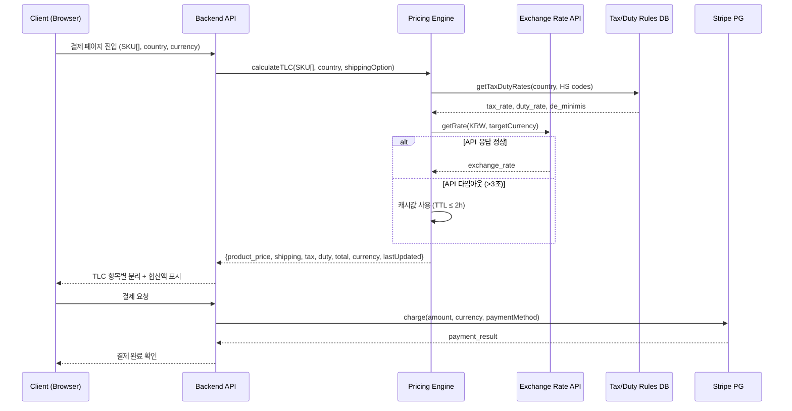

#### 3.4.2 통관 가능 여부 확인 흐름 (F2)

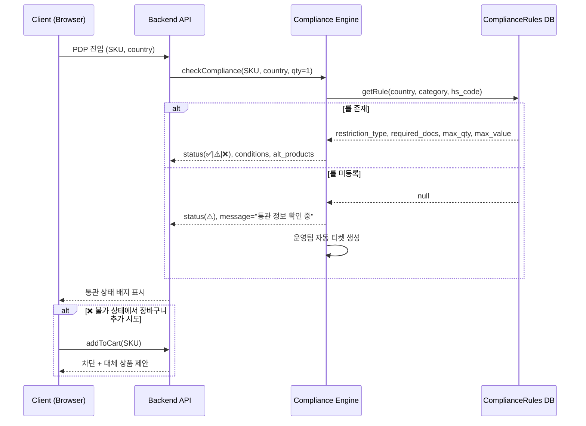

#### 3.4.3 주소 실시간 검증 흐름 (F3)

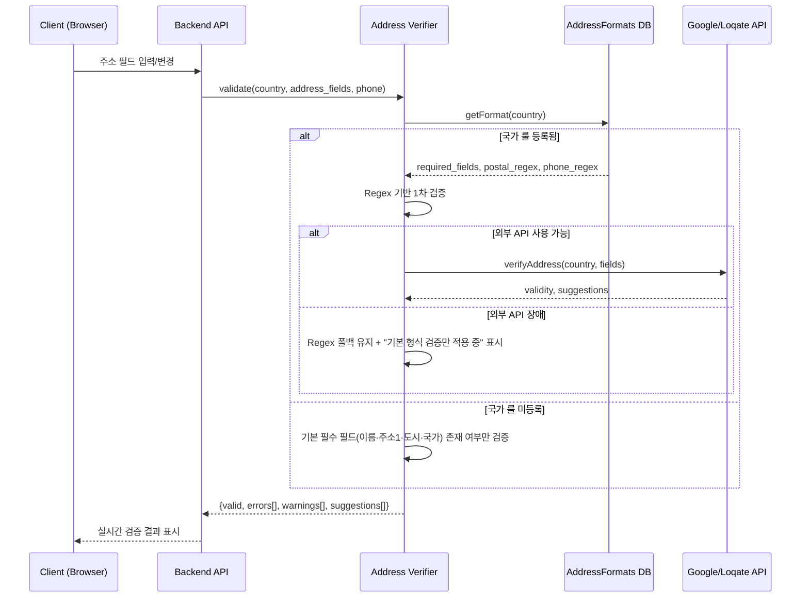

#### 3.4.4 접속 IP 기반 목적국 확인 흐름 (F17)

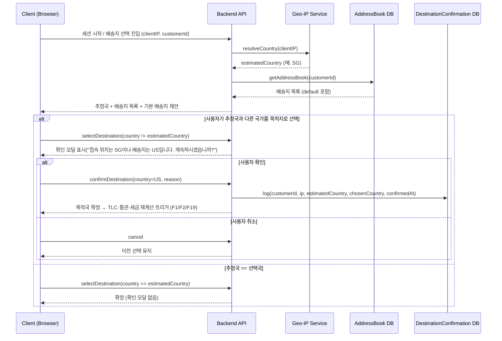

#### 3.4.5 PG 라우팅 결제 흐름 (F16)

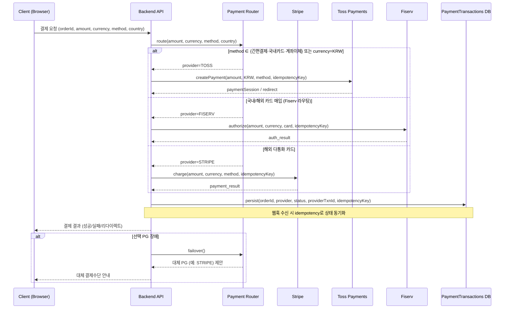

#### 3.4.6 생성형 AI 챗봇 응답 흐름 (F18)

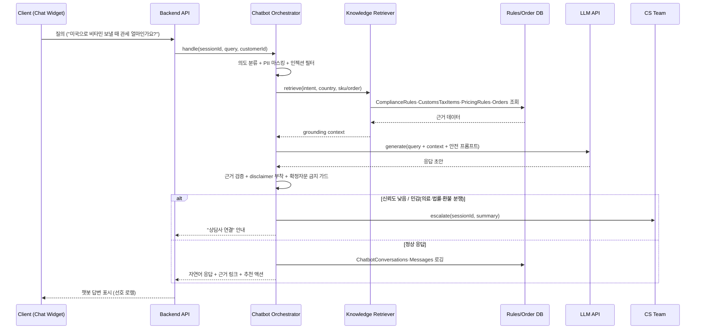

#### 3.4.7 AI 컨텐츠 번역·검수 흐름 (F15)

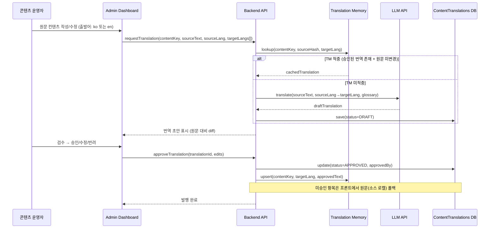

---

## 4. Specific Requirements

### 4.1 Functional Requirements

#### 4.1.1 F1 — 예상 총액 확정 보기 (Pricing / TLC Display)

| ID | 요구사항 | Priority | Source | Acceptance Criteria |
|---|---|---|---|---|
| REQ-FUNC-101 | 시스템은 사용자가 결제 페이지에 진입할 때 대표 5개국 중 하나가 배송지로 설정된 경우 상품가·국제배송비·예상 세금·관세를 항목별로 분리하여 합산액과 함께 표시해야 한다. | Must | Story 1, AC1-1 | **Given** 대표 5개국 중 하나를 배송지로 선택한 상태 **When** 결제 페이지 진입 **Then** 상품가·배송비·세금·관세 항목별 분리 + 합산액이 노출된다. 응답 시간 ≤ 1초. 항목 누락률 0%. |
| REQ-FUNC-102 | 시스템은 사용자가 현지 통화를 선택할 때 실시간 환율(1시간 갱신)을 적용한 현지 통화 기준 총비용을 표시해야 한다. | Must | Story 1, AC1-2 | **Given** 사용자가 현지 통화로 변경 **When** 총비용 화면 표시 **Then** 환율 오차 ≤ 0.5%인 실시간 환율 기반 현지 통화 총비용 표시. 환율 API 실패율 < 0.5%. |
| REQ-FUNC-103 | 시스템은 세금이 불확실한 국가/SKU 조합에 대해 확정 항목과 예상 항목을 분리하고 disclaimer를 표시해야 한다. | Must | Story 1, AC1-3 | **Given** 세금 불확실 국가/SKU **When** 총비용 표시 시 **Then** disclaimer 표시 + 확정/예상 항목 분리. disclaimer 미표시 오류율 0%. |
| REQ-FUNC-104 | 환율/세금 API 타임아웃(3초 초과) 시 시스템은 캐시값(TTL ≤ 2시간)으로 폴백 표시하고 "최종 업데이트: HH:MM"을 노출해야 한다. 캐시 TTL 초과 시 결제를 차단하고 "잠시 후 재시도" 메시지를 표시해야 한다. | Must | Story 1, AC1-F1 | **Given** 환율/세금 API 타임아웃(>3초) **When** 총비용 표시 시도 **Then** 캐시 폴백 성공률 ≥ 99%. 캐시 TTL 초과 시 결제 차단 + 메시지 표시율 100%. |
| REQ-FUNC-105 | 대표 5개국 외 비지원 국가가 배송지로 선택된 경우 시스템은 "해당 국가는 세금·관세 예상 미제공" 안내를 표시하고 상품가·배송비만 표시해야 한다. 안내 없이 결제 진행을 차단해야 한다. | Must | Story 1, AC1-F2 | **Given** 비지원 국가 배송지 선택 **When** 총비용 표시 시도 **Then** 비지원국 안내 표시율 100%. 안내 없는 결제 진행 차단율 100%. |
| REQ-FUNC-106 | Pricing Engine은 PricingRules DB에서 국가코드·HS Code 기반으로 tax_rate, duty_rate, de_minimis 값을 조회하여 TLC를 산출해야 한다. | Must | F1, ADR-1 | **Given** 유효한 국가코드·HS Code **When** TLC 산출 요청 **Then** PricingRules 테이블에서 정확한 세율 조회 후 TLC 반환. 비용 계산 오류율 ≤ 0.5%. |
| REQ-FUNC-107 | 시스템은 장바구니 화면에서도 선택된 배송지 기준 TLC 예상 합산액을 표시해야 한다. | Must | Story 1 | **Given** 장바구니에 상품이 존재하고 배송지가 설정된 상태 **When** 장바구니 페이지 로드 **Then** TLC 예상 합산액 표시. |

#### 4.1.2 F2 — 통관 가능 여부 사전 확인 (Compliance Check)

| ID | 요구사항 | Priority | Source | Acceptance Criteria |
|---|---|---|---|---|
| REQ-FUNC-201 | 시스템은 사용자의 배송 국가가 설정된 상태에서 PDP 진입 시 해당 SKU의 통관 상태(✅ 허용 / ⚠️ 조건부 / ❌ 불가)를 즉시 표시해야 한다. | Must | Story 2, AC2-1 | **Given** 배송 국가 설정 상태 **When** PDP 진입 **Then** 통관 상태 배지 즉시 표시. 응답 ≤ 500ms. 정확도 ≥ 95%. |
| REQ-FUNC-202 | ⚠️ 조건부 상태인 경우 사용자가 상세를 클릭하면 필요서류·수량 제한·금액 제한 등 조건 안내를 표시해야 한다. | Must | Story 2, AC2-2 | **Given** ⚠️ 조건부 상태 **When** 상세 클릭 **Then** 조건 설명 표시. 조건 설명 누락률 ≤ 2%. |
| REQ-FUNC-203 | ❌ 불가 상태인 SKU에 대해 장바구니 추가를 차단하고 대체 상품을 제안해야 한다. | Must | Story 2, AC2-3 | **Given** ❌ 불가 상태 **When** 장바구니 추가 시도 **Then** 추가 차단(우회율 0%) + 대체 제안 ≥ 80%. |
| REQ-FUNC-204 | 해당 국가/카테고리/HS Code 룰이 미등록인 경우 ⚠️ "통관 정보 확인 중. 주문 전 고객센터 문의" + CS 링크를 표시하고 운영팀에 자동 티켓을 생성해야 한다. | Must | Story 2, AC2-F1 | **Given** 룰 미등록 **When** 통관 상태 표시 시도 **Then** 무판정(빈 상태) 노출률 0%. 티켓 생성 지연 ≤ 1분. |
| REQ-FUNC-205 | Compliance Engine 서비스 장애(5xx/타임아웃) 시 캐시된 최근 판정 결과를 표시하고 "정보가 최신이 아닐 수 있습니다" 경고를 표시해야 한다. 장애 5분 이상 지속 시 PagerDuty 알림을 발송해야 한다. | Must | Story 2, AC2-F2 | **Given** Compliance Engine 장애 **When** 통관 상태 표시 시도 **Then** 캐시 폴백 성공률 ≥ 95%. 5분+ 장애 시 PagerDuty 알림 발송. |
| REQ-FUNC-206 | Compliance Engine은 ComplianceRules DB 테이블에서 country_code, category_code, hs_code 기반으로 restriction_type, required_docs, max_quantity, max_value를 조회하여 판정해야 한다. | Must | F2, ADR-1 | **Given** 유효한 country_code, SKU **When** 통관 판정 요청 **Then** ComplianceRules 테이블 기반 판정 반환. |
| REQ-FUNC-207 | 운영팀은 Admin Dashboard에서 ComplianceRules의 국가별·카테고리별 룰을 생성·조회·수정·삭제(CRUD)할 수 있어야 한다. 변경 이력이 추적되어야 한다. | Must | ADR-1 | **Given** 운영팀 관리자 로그인 **When** ComplianceRules CRUD 수행 **Then** 즉시 반영 + 변경 이력(변경자, 변경일시, 변경 전후 값) 저장. |

#### 4.1.3 F3 — 주소·연락처 실시간 검증 (Address Verification)

| ID | 요구사항 | Priority | Source | Acceptance Criteria |
|---|---|---|---|---|
| REQ-FUNC-301 | 시스템은 주소 입력 필드 값 변경 시 우편번호·필수 필드·지역-도시 매칭을 실시간 검증해야 한다. | Must | Story 3, AC3-1 | **Given** 주소 입력 중 **When** 필드 값 변경 시 **Then** 실시간 검증 결과 표시. 지연 ≤ 300ms. 오탐률(false positive) ≤ 1%. |
| REQ-FUNC-302 | 시스템은 전화번호 입력 시 해당 국가 형식에 맞는지 검증하고 유효하지 않으면 경고와 올바른 형식 예시를 표시해야 한다. | Must | Story 3, AC3-2 | **Given** 전화번호 입력 **When** 형식 확인 **Then** 포맷 오류 미검출률 ≤ 3%. 올바른 형식 예시 표시. |
| REQ-FUNC-303 | 배송 실패 위험이 높은 주소로 결제를 진행하려 할 때 시스템은 블로킹 경고를 표시하고 수정 안내를 제공해야 한다. | Must | Story 3, AC3-3 | **Given** 배송 실패 위험 높은 주소 **When** 결제 진행 시도 **Then** 블로킹 경고 + 수정 안내. 경고-실제 실패 상관도 ≥ 70%. |
| REQ-FUNC-304 | AddressFormats에 해당 국가 룰이 미등록인 경우 기본 필수 필드(이름·주소1·도시·국가) 존재 여부만 검증하고 "상세 주소 검증 미지원 국가" 안내를 표시해야 한다. 미등록국에서 경고 없이 결제가 통과되면 안 된다. | Must | Story 3, AC3-F1 | **Given** 국가 룰 미등록 **When** 주소 검증 시도 **Then** 기본 필드 검증 + 안내 표시. 미등록국 무검증 통과율 0%. |
| REQ-FUNC-305 | 주소 검증 외부 API(Google/Loqate) 장애 시 자체 Regex 기반 폴백 검증으로 자동 전환하고 "기본 형식 검증만 적용 중" 안내를 표시해야 한다. 장애 5분 이상 시 Slack 알림을 발송해야 한다. | Must | Story 3, AC3-F2 | **Given** 외부 API 장애 **When** 주소 검증 시도 **Then** Regex 폴백 전환 지연 ≤ 5초. 폴백 중 검증 누락률 0%. 5분+ 시 Slack 알림. |
| REQ-FUNC-306 | 시스템은 libphonenumber 라이브러리를 사용하여 국가별 전화번호 형식을 검증해야 한다. | Must | F3 | **Given** 전화번호 및 국가코드 입력 **When** 검증 요청 **Then** libphonenumber 기반 검증 결과 반환. |

#### 4.1.4 F4 — 배송 ETA·예외 가이드 (Fulfillment Tracking & Exception Guide)

| ID | 요구사항 | Priority | Source | Acceptance Criteria |
|---|---|---|---|---|
| REQ-FUNC-401 | "통관 보류" 상태 변경 시 시스템은 10분 이내에 알림을 발송하고 추가서류 안내·제출 방법·예상 처리기간을 포함한 가이드를 제공해야 한다. | Must | Story 4, AC4-1 | **Given** "통관 보류" 상태 변경 **When** 알림 수신/상태 페이지 접근 **Then** 알림 지연 ≤ 10분. 가이드 제공률 100%. |
| REQ-FUNC-402 | "현지 배송 지연" 상태에서 시스템은 지연일수·사유·대응 옵션을 표시하고 ETA를 재계산해야 한다. | Must | Story 4, AC4-2 | **Given** "현지 배송 지연" 상태 **When** 상태 확인 **Then** 지연일수+사유+대응옵션 표시. ETA 재계산 정확도 ≥ 80%. |
| REQ-FUNC-403 | 예외 해소 후 정상 복귀 시 시스템은 "문제 해결, 예상 도착일: X" 알림을 발송해야 한다. | Must | Story 4, AC4-3 | **Given** 예외 해소·정상 복귀 **When** 상태 변경 시 **Then** 복귀 알림 발송. 누락률 ≤ 1%. |
| REQ-FUNC-404 | 물류사 Tracking API가 24시간 이상 무응답인 경우 시스템은 마지막 수신 상태 + "마지막 업데이트: YYYY-MM-DD HH:MM" + "48시간 내 미갱신 시 CS 자동 연락" 메시지를 표시해야 한다. 48시간 초과 시 CS 자동 티켓을 생성해야 한다. | Must | Story 4, AC4-F1 | **Given** Tracking API 24h+ 무응답 **When** 주문 상태 페이지 조회 **Then** 마지막 상태+타임스탬프+안내 표시. 48h 초과 시 CS 티켓 생성률 100%. |
| REQ-FUNC-405 | 알림 발송 시스템 장애로 예외 알림 발송 실패 시 재시도 큐(최대 3회, 간격 5분·15분·60분)에 등록하고, 3회 실패 시 CS팀에 수동 연락 대상 목록으로 에스컬레이션해야 한다. | Must | Story 4, AC4-F2 | **Given** 알림 발송 실패 **When** 배송 예외 상태 변경 발생 **Then** 재시도 큐 등록. 알림 최종 미도달률 ≤ 0.5%. 에스컬레이션 지연 ≤ 70분. |
| REQ-FUNC-406 | 시스템은 물류사 Tracking API에서 수신한 배송 이벤트를 표준 상태(출고·국제운송·통관진행·통관완료·현지배송·배송완료)로 매핑하여 고객에게 표시해야 한다. | Must | F4 | **Given** 물류사로부터 배송 이벤트 수신 **When** 이벤트 처리 **Then** 표준 상태로 매핑 후 고객 주문 상태 페이지에 반영. |
| REQ-FUNC-407 | 시스템은 4대 예외 시나리오(통관 보류, 현지 배송 지연, 반송, 수령 불가)에 대해 사용자 행동 가이드를 제공해야 한다. | Must | F4 | **Given** 4대 예외 중 하나 발생 **When** 고객이 주문 상태 확인 **Then** 해당 예외별 맞춤 행동 가이드 표시. |

#### 4.1.5 F5 — 정품 신뢰 신호 (Authenticity Trust Signals)

| ID | 요구사항 | Priority | Source | Acceptance Criteria |
|---|---|---|---|---|
| REQ-FUNC-501 | 인증된 브랜드 상품 조회 시 상품 목록 및 PDP에서 브랜드 공식 인증 배지를 즉시 표시해야 한다. | Must | Story 5, AC5-1 | **Given** 인증 브랜드 상품 조회 **When** 목록/PDP 진입 **Then** 인증 배지 즉시 표시. 미표시 오류율 0%. |
| REQ-FUNC-502 | 정품 보증 정책 링크 클릭 시 정책·반품·직배송 프로세스를 1페이지 내에서 확인할 수 있어야 한다. | Must | Story 5, AC5-2 | **Given** 정품 보증 정책 링크 클릭 **When** 페이지 로드 **Then** 로드 ≤ 2초. 정보 완결성 100%. |
| REQ-FUNC-503 | PDP에서 SKU별 유통기한 및 잔여일을 표시해야 한다. | Must | Story 5, AC5-3 | **Given** PDP 확인 **When** 유통기한 영역 표시 **Then** SKU별 유통기한+잔여일 표시. 커버리지 ≥ 95%. |
| REQ-FUNC-504 | 유통기한 정보 미등록 SKU의 경우 "유통기한 정보 확인 중" 플레이스홀더를 표시하고 운영팀에 데이터 입력 요청 알림을 자동 발송해야 한다. 잘못된 유통기한을 표시해서는 안 된다. | Must | Story 5, AC5-F1 | **Given** 유통기한 미등록 SKU **When** PDP 표시 **Then** 플레이스홀더 표시. 잘못된 유통기한 표시 오류율 0%. 알림 지연 ≤ 5분. |
| REQ-FUNC-505 | 브랜드 인증 DB와 상품 카탈로그 간 인증 상태 불일치 감지 시 인증 DB를 SSOT로 사용하여 안전 방향(배지 미표시)으로 판정하고 운영팀에 데이터 정합성 검토 티켓을 자동 생성해야 한다. | Must | Story 5, AC5-F2 | **Given** 인증 DB-카탈로그 불일치 **When** PDP 진입 **Then** 잘못된 배지 표시율 0%. 불일치 감지→티켓 생성 지연 ≤ 5분. |
| REQ-FUNC-506 | Products 테이블의 is_certified 필드는 브랜드 인증 DB에서만 갱신되어야 하며, 카탈로그 동기화 시 인증 DB를 SSOT로 사용해야 한다. | Must | F5, AC5-F2 | **Given** 상품 카탈로그 동기화 실행 **When** is_certified 값 갱신 **Then** 인증 DB 기준으로만 갱신. |

#### 4.1.6 F6 — 건기식 설명 카드 (Health Supplement Info Card)

| ID | 요구사항 | Priority | Source | Acceptance Criteria |
|---|---|---|---|---|
| REQ-FUNC-601 | PDP에서 건강기능식품 SKU의 성분·복용법·주의사항을 구조화된 카드 형태로 표시해야 한다. | Should | F6 | **Given** 건기식 SKU PDP 진입 **When** 설명 카드 영역 표시 **Then** 성분·복용법·주의사항 구조화 표시. |
| REQ-FUNC-602 | 건기식 설명 카드는 사용자의 preferred_lang에 맞는 언어로 표시되어야 한다. | Should | F6 | **Given** 사용자 언어 설정 (en/ko) **When** 설명 카드 로드 **Then** 해당 언어로 표시. |
| REQ-FUNC-603 | 운영팀은 Admin Dashboard에서 SKU별 성분·복용법 구조화 데이터를 입력·수정할 수 있어야 한다. | Should | F6 | **Given** 운영팀 로그인 **When** 건기식 데이터 입력/수정 **Then** 즉시 반영 + 변경 이력 저장. |

#### 4.1.7 F7 — 빠른 재주문 (Quick Reorder)

| ID | 요구사항 | Priority | Source | Acceptance Criteria |
|---|---|---|---|---|
| REQ-FUNC-701 | 시스템은 고객의 과거 주문 내역에서 "재주문" 버튼을 통해 동일 상품을 장바구니에 복제할 수 있어야 한다. | Should | F7 | **Given** 주문 내역 화면 **When** "재주문" 버튼 클릭 **Then** 해당 주문의 상품이 장바구니에 복제됨. |
| REQ-FUNC-702 | 재주문 시 품절·단종·가격 변동·통관 불가 상태 변경이 있는 경우 사용자에게 즉시 알려야 한다. | Should | F7 | **Given** 재주문 요청 **When** 상품 상태 변경이 존재 **Then** 변경 사항 알림 표시 (품절/단종/가격변동/통관불가). |

#### 4.1.8 F8~F10 — Could 기능

| ID | 요구사항 | Priority | Source | Acceptance Criteria |
|---|---|---|---|---|
| REQ-FUNC-801 | 시스템은 통관 안전 SKU 조합으로 구성된 저위험 첫 구매 패키지를 제안할 수 있어야 한다. | Could | F8 | **Given** 첫 방문 고객 **When** 메인/카테고리 페이지 **Then** 저위험 번들 제안 표시. |
| REQ-FUNC-901 | 품절 SKU에 대해 재입고 알림을 신청할 수 있어야 한다. | Could | F9 | **Given** 품절 SKU PDP **When** 알림 신청 **Then** 재입고 시 알림 발송. |
| REQ-FUNC-1001 | 시스템은 통관 룰·합산 최적화 기반의 안전 번들 추천을 표시할 수 있어야 한다. | Could | F10 | **Given** 장바구니 또는 PDP **When** 번들 추천 영역 **Then** 통관 안전+가격 최적화 번들 제안. |

#### 4.1.9 F15 — 생성형 AI 다국어 번역 (AI Content Translation / i18n)

> 프론트(고객) 및 어드민(운영) 컨텐츠를 **한국어·영어를 출발어(원문)**로 하여 생성형 AI(LLM) 번역으로 다국어 제공한다. 번역본은 운영자 검수·승인 후 노출하며, 미승인 시 원문(소스 로캘)으로 폴백한다.

| ID | 요구사항 | Priority | Source | Acceptance Criteria |
|---|---|---|---|---|
| REQ-FUNC-1501 | 시스템은 프론트 및 어드민의 번역 대상 컨텐츠(상품명·설명·UI 라벨·배너·정책·건기식 카드·통관/세금 안내 등)를 원문(소스) + 로캘별 번역본으로 분리 저장하는 i18n 데이터 모델로 관리해야 한다. 코드 내 표시 문자열 하드코딩은 금지한다. | Must | CR-2026-06 §1 | **Given** 번역 대상 컨텐츠 **When** 저장 **Then** `ContentTranslations`에 (contentKey, sourceLang, targetLang, status)로 저장. 하드코딩 문자열 검출 0건(린트). |
| REQ-FUNC-1502 | 시스템은 출발어를 한국어(ko) 또는 영어(en)로 하여 생성형 AI(LLM)로 도착어(en/ko/ja/zh) 번역 초안을 생성해야 한다. | Must | CR-2026-06 §1 | **Given** 원문(ko 또는 en) **When** 번역 요청 **Then** 지정 도착어 번역 초안 생성. 출발어가 ko·en이 아니면 거부. |
| REQ-FUNC-1503 | 운영자는 Admin Dashboard에서 AI 번역 초안을 원문 대비 검수하여 승인·수정·반려할 수 있어야 하며, 승인된 번역만 프론트/어드민에 노출되어야 한다. | Must | CR-2026-06 §1,4 | **Given** 번역 초안(DRAFT) **When** 운영자 승인 **Then** status=APPROVED + approvedBy·approvedAt 기록. 미승인 번역 노출률 0%. |
| REQ-FUNC-1504 | 승인된 번역이 없거나 원문이 변경되어 번역이 stale 상태인 경우 시스템은 원문(소스 로캘)으로 폴백 표시하고, 통관·세금·성분 등 핵심 항목은 "번역 검수 중" 라벨을 표시해야 한다. | Must | CR-2026-06 §1, RSK-07 | **Given** 미승인/stale 번역 **When** 프론트 렌더 **Then** 원문 폴백 + 핵심항목 라벨 표시. 오역 노출 0%. |
| REQ-FUNC-1505 | 시스템은 번역 메모리(TM)와 용어집(Glossary)을 운영하여 승인된 번역을 재사용하고 고정 용어(브랜드명·성분명·HS 용어)의 일관성을 보장해야 한다. | Should | CR-2026-06 §1, RSK-12 | **Given** 동일 원문·도착어 재요청 **When** 번역 **Then** TM 적중 시 LLM 미호출(재사용). 용어집 위반율 ≤ 1%. |
| REQ-FUNC-1506 | 시스템은 사용자의 선호 로캘 또는 Geo-IP 추정 로캘에 따라 프론트 컨텐츠를 해당 언어로 렌더링하고, 사용자가 언어를 수동 변경할 수 있어야 한다. | Must | CR-2026-06 §1 | **Given** 선호 로캘 설정/추정 **When** 페이지 로드 **Then** 해당 로캘 렌더. 수동 전환 시 즉시 반영 + 선호값 저장. |
| REQ-FUNC-1507 | 원문 컨텐츠가 변경되면 시스템은 해당 컨텐츠의 모든 도착어 번역을 stale로 표시하고 운영자에게 재검수 알림을 발송해야 한다. | Should | CR-2026-06 §1 | **Given** 원문 수정 **When** 저장 **Then** 연결된 번역 status=STALE + 운영자 알림. 누락률 ≤ 1%. |

#### 4.1.10 F16 — 한국 PG 결제 확장 (Toss / Fiserv)

> 기존 Stripe 다통화 결제에 더해 한국 PG(**Toss Payments, Fiserv**)를 추가 결제수단으로 연동한다. 통화·결제수단·국가 기준으로 PG를 라우팅한다.

| ID | 요구사항 | Priority | Source | Acceptance Criteria |
|---|---|---|---|---|
| REQ-FUNC-1601 | 시스템은 Stripe(다통화), Toss Payments, Fiserv를 결제수단으로 제공하고, 통화·결제수단·국가 기준 라우팅 규칙으로 PG를 선택해야 한다. | Must | CR-2026-06 §2, CON-08 | **Given** 주문(amount, currency, method, country) **When** 결제 진입 **Then** 라우팅 규칙에 따른 PG 선택. 선택 오류율 0%. |
| REQ-FUNC-1602 | 시스템은 Toss Payments를 통해 간편결제·국내 카드·계좌이체 결제를 처리하고 결제 결과(승인/실패/대기)를 주문에 반영해야 한다. | Must | CR-2026-06 §2 | **Given** Toss 결제수단 선택 **When** 결제 요청 **Then** Toss 세션 생성·승인 처리 + 주문 상태 반영. |
| REQ-FUNC-1603 | 시스템은 Fiserv를 통해 카드 매입(authorize/capture)·취소·환불을 처리하고 정산 데이터를 기록해야 한다. | Must | CR-2026-06 §2 | **Given** Fiserv 라우팅 **When** 결제/환불 **Then** authorize·capture·refund 처리 + `PaymentTransactions` 기록. |
| REQ-FUNC-1604 | 모든 PG 연동은 멱등키(idempotency key)와 웹훅 서명 검증을 사용하여 중복 결제·이벤트 중복 처리를 방지해야 한다. | Must | CR-2026-06 §2, RSK-09 | **Given** 동일 idempotencyKey 재요청/중복 웹훅 **When** 처리 **Then** 중복 승인·중복 반영 0건. 웹훅 서명 검증 100%. |
| REQ-FUNC-1605 | 선택된 PG 장애·승인 실패 시 시스템은 대체 PG(예: Stripe) 또는 다른 결제수단을 안내하고, 사용자에게 명확한 실패 사유를 표시해야 한다. | Must | CR-2026-06 §2, RSK-09 | **Given** PG 장애/거절 **When** 결제 시도 **Then** 대체 수단 안내 + 사유 표시. 미안내 종료율 0%. |
| REQ-FUNC-1606 | 시스템은 PG별 거래·정산 내역을 통화·상태별로 기록하고, 운영자가 Admin Dashboard에서 조회 및 정산 대사(reconciliation)할 수 있어야 한다. | Must | CR-2026-06 §2 | **Given** 결제·웹훅 발생 **When** 거래 기록 **Then** `PaymentTransactions`에 provider·status·통화·정산정보 기록 + 어드민 조회. |
| REQ-FUNC-1607 | 결제 금액은 F1(TLC)·F19(통관규정 세금항목)에서 산출된 최종 확정 금액과 통화를 그대로 사용해야 하며, PG로 전달되는 금액과 화면 표시 금액이 일치해야 한다. | Must | CR-2026-06 §2,5 | **Given** TLC 확정 금액 **When** PG 결제 **Then** 표시-청구 금액 불일치 0%. |

#### 4.1.11 F17 — 배송지 목록 관리 & 접속 IP 기반 목적국 확인 (Address Book & Geo Destination)

> 로그인 사용자는 **배송지 목록**을 관리할 수 있다. 시스템은 접속 IP로 목적국을 추정하되, 사용자가 추정국과 **다른 국가**를 선택하면 명시적 **확인** 프로세스를 거친다.

| ID | 요구사항 | Priority | Source | Acceptance Criteria |
|---|---|---|---|---|
| REQ-FUNC-1701 | 로그인 사용자는 자신이 관리하는 배송지 목록을 생성·조회·수정·삭제(CRUD)하고 기본 배송지를 지정할 수 있어야 한다. | Must | CR-2026-06 §3 | **Given** 로그인 사용자 **When** 배송지 CRUD **Then** `ShippingAddresses`에 사용자별 목록 저장 + 기본 배송지 1건 유지. |
| REQ-FUNC-1702 | 각 배송지는 F3 주소·연락처 실시간 검증을 거쳐야 하며, 미검증 배송지는 결제 단계에서 검증을 요구해야 한다. | Must | CR-2026-06 §3, F3 | **Given** 배송지 등록/선택 **When** 저장/결제 진입 **Then** F3 검증 수행 + is_verified 갱신. 미검증 통과율 0%. |
| REQ-FUNC-1703 | 시스템은 접속 IP를 Geo-IP로 분석하여 목적국 후보를 추정하고, 이를 배송지 선택의 기본 추천으로 제시해야 한다. | Must | CR-2026-06 §3 | **Given** 세션 접속 **When** 배송지 선택 화면 진입 **Then** Geo-IP 추정국을 추천 표시. 국가 추정 정확도 ≥ 99%(가용 시). |
| REQ-FUNC-1704 | 로그인 사용자가 Geo-IP 추정국과 다른 국가를 배송 목적지로 선택하는 경우 시스템은 차이를 알리는 확인(confirm) 모달을 표시하고 사용자의 명시적 확인을 받아야 한다. | Must | CR-2026-06 §3, RSK-10 | **Given** 선택국 ≠ 추정국 **When** 목적지 선택 **Then** 확인 모달 표시 + 명시적 확인 필수. 무확인 진행률 0%. |
| REQ-FUNC-1705 | 사용자가 목적국 변경을 확인하면 시스템은 확인 이력(접속 IP, 추정국, 선택국, 확인 일시)을 기록하고, 변경된 목적국 기준으로 TLC(F1)·통관(F2)·세금항목(F19)을 재계산해야 한다. | Must | CR-2026-06 §3,5 | **Given** 목적국 변경 확인 **When** 확정 **Then** `DestinationConfirmations` 기록 + F1/F2/F19 재계산 트리거. |
| REQ-FUNC-1706 | 최종 배송 목적국은 항상 사용자의 선택을 우선하며, Geo-IP 추정은 추천 용도로만 사용되어야 한다(추정 결과로 배송지를 강제 변경하지 않는다). | Must | CR-2026-06 §3, RSK-10 | **Given** 추정국과 선택국 상이 **When** 주문 확정 **Then** 배송지=사용자 선택값. 추정에 의한 강제 변경 0건. |
| REQ-FUNC-1707 | Geo-IP 서비스 장애·프록시/VPN으로 추정 불가 시 시스템은 추천을 생략하고 사용자가 배송지 목록에서 직접 선택하도록 유도해야 한다(결제 차단 없음). | Should | CR-2026-06 §3 | **Given** Geo-IP 불가 **When** 배송지 선택 **Then** 추천 생략 + 수동 선택 안내. 오류로 인한 결제 차단 0건. |

#### 4.1.12 F18 — 생성형 AI 자연어 챗봇 (Conversational AI Chatbot)

> 생성형 AI(LLM) 기반 자연어 챗봇으로 통관·세금·배송·주문·반품 등 CS 질의에 응답한다. 응답은 룰·주문 데이터에 근거(RAG)하며, 확정 자문이 필요한 경우 CS로 에스컬레이션한다.

| ID | 요구사항 | Priority | Source | Acceptance Criteria |
|---|---|---|---|---|
| REQ-FUNC-1801 | 시스템은 프론트에 챗봇 위젯을 제공하고, 사용자의 자연어 질의를 의도 분류하여 응답해야 한다. | Must | CR-2026-06 §4 | **Given** 챗봇 위젯 **When** 자연어 질의 입력 **Then** 의도 분류 + 응답 생성. 첫 응답 지연 p95 ≤ 5초. |
| REQ-FUNC-1802 | 챗봇은 통관(F2)·세금항목(F19)·TLC(F1)·주문/배송(F4) 관련 질의에 대해 ComplianceRules·CustomsTaxItems·PricingRules·Orders 데이터를 근거(RAG)로 사용하여 응답해야 한다. | Must | CR-2026-06 §4, CON-10 | **Given** 통관/세금/배송 질의 **When** 응답 생성 **Then** 룰·주문 데이터 근거 사용 + 근거 출처 표기. 근거 없는 확정 응답 0건. |
| REQ-FUNC-1803 | 챗봇은 세금·통관 등 법적 확정 정보 응답에 disclaimer를 부착하고, 의료·법률 확정 자문 및 미근거 추측 응답을 금지해야 한다. | Must | CR-2026-06 §4, CON-10, RSK-08 | **Given** 통관/세금/의료성 질의 **When** 응답 **Then** disclaimer 부착 + 확정 자문 거부. 가드 위반율 0%. |
| REQ-FUNC-1804 | 챗봇은 응답 신뢰도가 낮거나 환불 분쟁·계정·결제 오류 등 민감 사안인 경우 CS 상담사로 에스컬레이션해야 한다. | Must | CR-2026-06 §4 | **Given** 저신뢰/민감 질의 **When** 처리 **Then** CS 에스컬레이션 + 사용자 안내. 부적절 자동응답 0건. |
| REQ-FUNC-1805 | 챗봇은 사용자의 선호 로캘로 응답해야 하며, F15 번역 자산·용어집을 활용하여 다국어 응답 일관성을 유지해야 한다. | Must | CR-2026-06 §4, F15 | **Given** 사용자 로캘 **When** 응답 **Then** 해당 언어 응답 + 용어 일관성 유지. |
| REQ-FUNC-1806 | 시스템은 챗봇 대화(질의·응답·근거·에스컬레이션)를 로깅하고, 입력의 PII 마스킹 및 프롬프트 인젝션 방어를 적용해야 하며, 운영자가 Admin Dashboard에서 대화를 모니터링·라벨링할 수 있어야 한다. | Must | CR-2026-06 §4, RSK-08, REQ-NF-015 | **Given** 챗봇 대화 **When** 처리 **Then** `ChatbotConversations/Messages` 로깅 + PII 마스킹 + 인젝션 필터 + 어드민 조회. |
| REQ-FUNC-1807 | LLM API 장애·타임아웃 시 챗봇은 폴백 메시지(FAQ 링크 + CS 연결)를 제공하고 사용자를 막다른 상태에 두지 않아야 한다. | Should | CR-2026-06 §4 | **Given** LLM 장애 **When** 질의 **Then** 폴백 안내 + CS 연결. 무응답 종료율 0%. |

#### 4.1.13 F19 — 목적국별 통관규정 세금항목 관리·노출 (Customs Tax Items)

> 각 목적국별로 신설되는 **통관규정 세금항목**(VAT/GST·관세·소비세·통관수수료·면세한도 등)을 어드민에서 관리하고, 프론트에서 사용자가 확인할 수 있어야 한다.

| ID | 요구사항 | Priority | Source | Acceptance Criteria |
|---|---|---|---|---|
| REQ-FUNC-1901 | 운영자는 Admin Dashboard에서 목적국별 통관규정 세금항목(항목명·유형·세율/정액·과세표준·면세기준·적용조건·근거·발효일)을 생성·조회·수정·삭제(CRUD)할 수 있어야 한다. | Must | CR-2026-06 §5, CON-13 | **Given** 운영자 로그인 **When** 통관규정 세금항목 CRUD **Then** `CustomsTaxItems`에 저장 + 즉시 반영 + 변경 이력. |
| REQ-FUNC-1902 | 통관규정 세금항목은 PricingRules 및 ComplianceRules와 연계되어 F1(TLC) 산출과 F2(통관 판정)에 반영되어야 한다. | Must | CR-2026-06 §5, F1, F2 | **Given** 세금항목 변경 **When** TLC/통관 산출 **Then** 변경분 반영. 항목 누락 0%. |
| REQ-FUNC-1903 | 프론트는 PDP·장바구니·결제 화면에서 선택된 목적국의 통관규정 세금항목을 항목별로 분리하여 사용자에게 표시해야 하며, 합산은 F1 TLC와 일치해야 한다. | Must | CR-2026-06 §5, F1 | **Given** 목적국 설정 **When** PDP/장바구니/결제 표시 **Then** 세금항목별 분리 표시 + 합산 = TLC. 불일치 0%. |
| REQ-FUNC-1904 | 통관규정 세금항목 안내문은 F15 다국어 번역으로 사용자의 선호 로캘로 표시되어야 하며, 확정성이 불확실한 항목에는 disclaimer를 표시해야 한다. | Must | CR-2026-06 §5, F15 | **Given** 사용자 로캘 **When** 세금항목 표시 **Then** 해당 언어 표시 + 불확실 항목 disclaimer. |
| REQ-FUNC-1905 | 해당 목적국의 통관규정 세금항목이 미등록인 경우 시스템은 "세금항목 확인 중" 안내를 표시하고 운영팀에 입력 요청 티켓을 자동 생성해야 하며, 무근거 세금액을 표시해서는 안 된다. | Must | CR-2026-06 §5, ADR-1 | **Given** 세금항목 미등록국 **When** 표시 시도 **Then** 안내 + 티켓 생성. 무근거 세금 표시 0%. |
| REQ-FUNC-1906 | 세금항목 변경은 버전·발효일·변경자·변경 전후 값으로 이력 관리되어야 하며, 발효일 기준으로 적용되어야 한다. | Must | CR-2026-06 §5, REQ-NF-023 | **Given** 세금항목 수정 **When** 저장 **Then** version·effective_date·audit 기록 + 발효일 기준 적용. |

#### 4.1.14 F20 — 프론트 화면 구성 CMS & 리뷰 영상 (Storefront CMS & Review Videos)

> 관리자가 어드민에서 프론트 화면 구성(레이아웃·섹션·배너·노출 SKU)을 구성할 수 있어야 하며, 리뷰 영상을 프론트에 노출할 수 있어야 한다.

| ID | 요구사항 | Priority | Source | Acceptance Criteria |
|---|---|---|---|---|
| REQ-FUNC-2001 | 관리자는 Admin Dashboard에서 프론트 페이지(홈·카테고리·기획전 등)의 화면 구성(섹션 순서·배너·노출 SKU·영역별 콘텐츠)을 코드 배포 없이 구성·미리보기·발행할 수 있어야 한다. | Must | CR-2026-06 §6, CON-12 | **Given** 관리자 로그인 **When** CMS 구성·발행 **Then** `CmsLayouts/Sections`에 저장 + 발행 시 프론트 즉시 반영. 코드 배포 0회. |
| REQ-FUNC-2002 | CMS 구성은 로캘별로 관리되거나 F15 번역과 연계되어 사용자의 선호 로캘에 맞는 콘텐츠로 렌더링되어야 한다. | Must | CR-2026-06 §6, F15 | **Given** 로캘 설정 **When** CMS 페이지 렌더 **Then** 해당 로캘 콘텐츠 표시. |
| REQ-FUNC-2003 | 관리자는 리뷰 영상을 프론트의 지정 영역(홈·PDP·기획전)에 노출하도록 큐레이션·배치할 수 있어야 한다. | Must | CR-2026-06 §6 | **Given** 승인된 리뷰 영상 **When** CMS 배치 **Then** 지정 영역에 노출. 미승인 영상 노출 0%. |
| REQ-FUNC-2004 | 리뷰 영상은 외부 호스팅/CDN을 통해 트랜스코딩·스트리밍되어야 하며, 용량·포맷·길이 제한과 모바일 반응형 재생을 지원해야 한다. | Must | CR-2026-06 §6, EXT-10 | **Given** 영상 노출 **When** 재생 **Then** CDN 스트리밍 + 반응형 재생. 포맷/용량 위반 업로드 차단. |
| REQ-FUNC-2005 | 발행된 CMS 구성은 버전·발행자·발행일시로 이력 관리되어야 하며, 이전 버전으로 롤백할 수 있어야 한다. | Should | CR-2026-06 §6, REQ-NF-023 | **Given** CMS 발행 이력 **When** 롤백 요청 **Then** 이전 버전 복원 + 이력 기록. |
| REQ-FUNC-2006 | CMS 발행 실패·부분 오류 시 시스템은 직전 안정 버전을 유지하고 운영자에게 오류를 표시해야 한다(깨진 화면 노출 금지). | Should | CR-2026-06 §6 | **Given** 발행 오류 **When** 적용 시도 **Then** 직전 버전 유지 + 오류 표시. 깨진 화면 노출 0%. |

#### 4.1.15 F21 — 사용자 리뷰 관리·노출 (User Review Management)

> 사용자의 리뷰(텍스트·평점·이미지·영상)를 수집하고, 검수(모더레이션) 후 프론트에 노출·관리한다.

| ID | 요구사항 | Priority | Source | Acceptance Criteria |
|---|---|---|---|---|
| REQ-FUNC-2101 | 구매 사용자는 주문한 SKU에 대해 리뷰(평점·텍스트·이미지·영상)를 작성할 수 있어야 하며, 구매 검증(verified purchase) 여부가 표시되어야 한다. | Must | CR-2026-06 §7 | **Given** 배송 완료 주문 **When** 리뷰 작성 **Then** `Reviews`에 저장 + verified_purchase 표기. |
| REQ-FUNC-2102 | 모든 리뷰·리뷰 영상은 검수 워크플로(대기→승인/반려)를 거쳐야 하며, 승인된 리뷰만 프론트에 노출되어야 한다. | Must | CR-2026-06 §7, CON-14 | **Given** 제출된 리뷰 **When** 검수 **Then** status(PENDING/APPROVED/REJECTED) 관리. 미승인 노출 0%. |
| REQ-FUNC-2103 | 시스템은 리뷰 제출 시 욕설·PII·금지어 자동 필터를 적용하고, 위반 콘텐츠를 검수 대기/반려 처리해야 한다. | Must | CR-2026-06 §7, RSK-11 | **Given** 리뷰 제출 **When** 자동 필터 **Then** 위반 검출 시 PENDING/REJECT + 사유 기록. |
| REQ-FUNC-2104 | 관리자는 Admin Dashboard에서 리뷰를 검수·승인·반려·숨김·삭제하고, 신고된 리뷰를 처리할 수 있어야 한다. | Must | CR-2026-06 §7 | **Given** 운영자 로그인 **When** 리뷰 관리 **Then** 승인/반려/숨김/삭제/신고처리 + 변경 이력. |
| REQ-FUNC-2105 | 프론트는 PDP·기획전 등에서 승인된 리뷰를 평점 요약·정렬·필터(최신/평점/사진·영상 포함)와 함께 노출해야 하며, 사용자는 리뷰를 신고할 수 있어야 한다. | Must | CR-2026-06 §7 | **Given** 승인 리뷰 존재 **When** PDP 노출 **Then** 평점 요약·정렬·필터 표시 + 신고 기능. |
| REQ-FUNC-2106 | 리뷰 텍스트는 F15 다국어 번역으로 사용자의 선호 로캘로 표시할 수 있어야 하며(원문 보기 옵션 제공), 번역은 UGC 특성상 자동 표기되어야 한다. | Should | CR-2026-06 §7, F15 | **Given** 타 언어 리뷰 **When** 표시 **Then** 선호 로캘 번역 + "자동 번역" 표기 + 원문 보기. |
| REQ-FUNC-2107 | 리뷰 영상은 F20의 영상 호스팅/CDN 파이프라인을 사용하여 저장·트랜스코딩·노출되어야 한다. | Must | CR-2026-06 §7, F20 | **Given** 리뷰 영상 제출 **When** 처리 **Then** CDN 파이프라인 저장·트랜스코딩 + 승인 후 노출. |

### 4.2 Non-Functional Requirements

#### 4.2.1 성능 (Performance)

| ID | 요구사항 | 기준 | 측정 방법 | Source |
|---|---|---|---|---|
| REQ-NF-001 | Pricing Engine API (TLC 계산) 응답 시간 | p95 ≤ 1,000ms | APM (CloudWatch/Datadog) | REF-01 §5 |
| REQ-NF-002 | Compliance Engine API (통관 판정) 응답 시간 | p95 ≤ 500ms | APM | REF-01 §5 |
| REQ-NF-003 | Address Verification 피드백 응답 시간 | p95 ≤ 300ms | APM | REF-01 §5 |
| REQ-NF-004 | 페이지 로드 시간 (CDN) | p95 ≤ 2,000ms | APM / Lighthouse | REF-01 §5 |
| REQ-NF-005 | 외부 API 타임아웃 (환율·세금·주소검증) | 각 API ≤ 3초, 실패 시 최대 2회 재시도 (지수 백오프 1s→2s) | Application 로그 | REF-01 §5 |
| REQ-NF-006 | DB 핵심 쿼리 응답 (상품 조회·주문 생성·룰 판정) | p95 ≤ 200ms | APM / Slow Query Log | REF-01 §5 |
| REQ-NF-007 | 부하 테스트 통과 | 동시 접속 500명: p95 응답 ≤ 2초, 에러율 ≤ 1% | k6 또는 Locust (GA 전 필수 통과) | REF-01 §5 |

#### 4.2.2 신뢰성 (Reliability)

| ID | 요구사항 | 기준 | 측정 방법 | Source |
|---|---|---|---|---|
| REQ-NF-008 | 월 가용성 | ≥ 99.5% | Uptime 모니터링 | REF-01 §5 |
| REQ-NF-009 | 비용 계산 오류율 | ≤ 0.5% | 수동 검증 + 자동 비교 | REF-01 §5 |
| REQ-NF-010 | 통관 판정 정확도 | ≥ 95% | 수동 검수 대시보드 | REF-01 §5 |
| REQ-NF-011 | 결제 실패율 | ≤ 1% | PG 대시보드 | REF-01 §5 |
| REQ-NF-012 | 데이터 백업·복구 | RPO ≤ 1시간, RTO ≤ 4시간 | 복구 훈련 | REF-01 §5 |
| REQ-NF-013 | 외부 API 장애 내성 (환율·세금) | 캐시 폴백 TTL ≤ 2시간 | Application 로그 | REF-01 §5 |
| REQ-NF-014 | 외부 API 장애 내성 (주소 검증) | 자체 Regex 폴백 | Application 로그 | REF-01 §5 |

#### 4.2.3 보안 (Security)

| ID | 요구사항 | 기준 | Source |
|---|---|---|---|
| REQ-NF-015 | 개인정보 보호 | GDPR·CCPA 준수 | REF-01 §5 |
| REQ-NF-016 | 데이터 암호화 | AES-256 (저장 데이터), TLS 1.2+ (전송 데이터) | REF-01 §5 |
| REQ-NF-017 | 결제 보안 | PCI DSS Level 1 (Stripe 위임) | REF-01 §5 |
| REQ-NF-018 | 접근 제어 | Admin Dashboard RBAC (역할 기반 접근 제어) | REF-01 §5 |
| REQ-NF-019 | 감사 로그 | 룰 테이블 변경, 관리자 행동 로그 기록. 최소 1년 보존 | ADR-1 |

#### 4.2.4 확장성 (Scalability)

| ID | 요구사항 | 기준 | Source |
|---|---|---|---|
| REQ-NF-020 | 동시 접속 확장 | 초기 500 → 6개월 후 2,000 | REF-01 §5 |
| REQ-NF-021 | 국가 확장 | 모듈 구조로 국가 코드 파라미터 기반 권역별 동작 | ADR-4 |

#### 4.2.5 유지보수성 (Maintainability)

| ID | 요구사항 | 기준 | Source |
|---|---|---|---|
| REQ-NF-022 | 룰 테이블 운영팀 자체 관리 | 코드 배포 없이 운영팀이 Admin Dashboard에서 CRUD 가능 | ADR-1 |
| REQ-NF-023 | 룰 변경 이력 추적 | 변경자·변경일시·변경 전후 값 기록 | ADR-1 |

#### 4.2.6 비용 (Cost)

| ID | 요구사항 | 기준 | Source |
|---|---|---|---|
| REQ-NF-024 | 월 인프라 비용 | ≤ $3,000 (초기 AWS) | REF-01 §5 |
| REQ-NF-025 | 건당 CS 비용 | ≤ $2/건 (업계 평균 $3~5 대비) | REF-01 §9 |

#### 4.2.7 다국어·번역 (i18n / AI Translation)

| ID | 요구사항 | 기준 | Source |
|---|---|---|---|
| REQ-NF-026 | Phase 1 지원 언어 | 영어·한국어 | REF-01 §5 |
| REQ-NF-027 | Phase 2 지원 언어 | +일본어·중국어(간체) | REF-01 §5 |
| REQ-NF-046 | 번역 출발어(원문) | 한국어·영어로 한정 | CR-2026-06 §1 |
| REQ-NF-047 | AI 번역 품질 | 핵심 컨텐츠 운영자 승인율 ≥ 95%, 사후 오역 신고율 ≤ 1%. (자동 지표 COMET 참고) | CR-2026-06 §1 |
| REQ-NF-048 | 컨텐츠 문자열 하드코딩 | 0건 (i18n 키 외부화, 린트 게이트) | CON-11 |
| REQ-NF-049 | 번역 메모리(TM) 적중 시 LLM 미호출 | TM 적중률 측정·비용 절감 모니터링 | RSK-12 |
| REQ-NF-050 | 미승인/stale 번역 노출 | 0% (원문 폴백) | REQ-FUNC-1504 |

#### 4.2.8 모니터링 (Monitoring)

| ID | 요구사항 | 알림 기준 | 도구 | Source |
|---|---|---|---|---|
| REQ-NF-028 | 서버 응답 p95 모니터링 | > 2초 시 Slack 알림 | CloudWatch/Datadog | REF-01 §5 |
| REQ-NF-029 | 비용 계산 오류율 모니터링 | > 1% 시 PagerDuty | Application 로그 | REF-01 §5 |
| REQ-NF-030 | 통관 판정 실패 모니터링 | 일 5건 이상 운영팀 알림 | 수동 검수 대시보드 | REF-01 §5 |
| REQ-NF-031 | 배송 추적 단절 모니터링 | 24시간 무상태 변경 시 알림 | Fulfillment 로그 | REF-01 §5 |
| REQ-NF-032 | 결제 실패율 모니터링 | > 2% 시 알림 | PG 대시보드 | REF-01 §5 |
| REQ-NF-033 | 환율 API 상태 Health Check | 1분 주기. 연속 3회 실패 → Slack + 캐시 폴백 확인 | Health Check | REF-01 §5 |
| REQ-NF-034 | 주소 검증 API 상태 Health Check | 1분 주기. 연속 3회 실패 → Slack + Regex 폴백 전환 | Health Check | REF-01 §5 |
| REQ-NF-035 | 세금 계산 API 상태 Health Check | 1분 주기. 연속 3회 실패 → PagerDuty + 캐시 폴백 | Health Check | REF-01 §5 |
| REQ-NF-036 | DB 슬로우 쿼리 모니터링 | p95 > 500ms 발생 시 Slack | CloudWatch/Datadog APM | REF-01 §5 |
| REQ-NF-037 | 룰 테이블 미등록 요청 모니터링 | 미등록 국가/카테고리 일 10건 초과 시 운영팀 알림 | Application 로그 | REF-01 §5 |

#### 4.2.9 북극성 및 보조 KPI

| ID | KPI | 정의 | 기준선 | 목표 | 측정 주기 | 측정 도구 |
|---|---|---|---|---|---|---|
| REQ-NF-038 | 거래 완료율 (북극성) | (수령 확인 건 ÷ 결제 완료 건) × 100 | 추정 75% | Beta ≥ 82%, GA ≥ 90% | 주간 | Mixpanel `order_delivered_confirmed` + 물류사 Webhook |
| REQ-NF-039 | 장바구니→결제 전환율 | (결제 완료 수 ÷ 장바구니 생성 수) × 100 | ≤ 10% | Beta ≥ 12%, GA ≥ 15% | 주간 | Mixpanel Funnel |
| REQ-NF-040 | 주소 오류율 | (검증 실패 후 미수정 제출 건 ÷ 전체 주문 건) × 100 | ≥ 15% | Beta ≤ 8%, GA ≤ 5% | 주간 | Address Verification 로그 + Order JOIN |
| REQ-NF-041 | 통관 실패율 | (통관 반려·반송 건 ÷ 전체 출고 건) × 100 | ≥ 8% | Beta ≤ 5%, GA ≤ 3% | 월간 | 물류사 통관 API + 수동 반려 보고 |
| REQ-NF-042 | 배송 CS 비중 | (배송 CS 건 ÷ 전체 CS 건) × 100 | ≥ 50% | Beta ≤ 40%, GA ≤ 30% | 월간 | CS 티켓 태그 (Zendesk/Freshdesk) |
| REQ-NF-043 | 첫 구매 이탈률 | (첫 방문 후 30일 내 미구매 ÷ 첫 방문) × 100 | ≥ 70% | Beta ≤ 65%, GA ≤ 60% | 월간 | Mixpanel Cohort |
| REQ-NF-044 | 60일 재구매율 | (60일 내 2회+ 결제 고객 ÷ 첫 구매 고객) × 100 | 미측정 | Beta ≥ 15%, GA ≥ 25% | 월간 | Order 테이블 집계 |
| REQ-NF-045 | NPS | 표준 NPS 설문 (0~10점) | 미측정 | Beta ≥ 30, GA ≥ 40 | 분기 | 주문 후 7일 자동 이메일 설문 (Typeform) |

#### 4.2.10 생성형 AI 챗봇 (Conversational AI)

| ID | 요구사항 | 기준 | 측정 방법 | Source |
|---|---|---|---|---|
| REQ-NF-051 | 챗봇 첫 응답 지연 | p95 ≤ 5초 | APM | CR-2026-06 §4 |
| REQ-NF-052 | 챗봇 근거(RAG) 사용률 | 통관·세금·배송 질의의 100%가 룰·주문 데이터 근거 사용 | 응답 로그 감사 | CON-10 |
| REQ-NF-053 | 챗봇 안전 가드 위반율 (확정 자문·미근거 추측) | 0% | 응답 검수 대시보드 | RSK-08 |
| REQ-NF-054 | 챗봇 에스컬레이션 정확도 | 민감/저신뢰 질의의 적시 CS 전환율 ≥ 95% | CS 티켓 매칭 | CR-2026-06 §4 |
| REQ-NF-055 | LLM API 장애 폴백 | FAQ+CS 폴백 제공, 무응답 종료율 0% | Application 로그 | REQ-FUNC-1807 |
| REQ-NF-056 | 챗봇 입력 보안 | PII 마스킹 + 프롬프트 인젝션 필터 적용률 100% | 보안 테스트 | REQ-NF-015 |

#### 4.2.11 결제 (Payment — Multi-PG)

| ID | 요구사항 | 기준 | 측정 방법 | Source |
|---|---|---|---|---|
| REQ-NF-057 | PG 라우팅 정확도 | 통화·수단·국가 기준 라우팅 오류율 0% | 결제 로그 | CR-2026-06 §2 |
| REQ-NF-058 | 중복 결제 방지 | 멱등키·웹훅 서명 검증으로 중복 승인 0건 | 결제 대사 | RSK-09 |
| REQ-NF-059 | 표시-청구 금액 일치율 | 100% | 결제 검증 | REQ-FUNC-1607 |
| REQ-NF-060 | PG 장애 폴백 | 대체 PG/수단 안내율 100% | 결제 로그 | RSK-09 |
| REQ-NF-061 | 정산 대사(reconciliation) | 일배치 대사 불일치 ≤ 0.1%, 불일치 시 알림 | 정산 배치 | CR-2026-06 §2 |
| REQ-NF-062 | 결제 보안 | 한국 PG 연동 포함 PCI DSS 범위 준수(민감 카드정보 비보관) | 보안 감사 | REQ-NF-017 |

#### 4.2.12 배송지·Geo-IP (Address Book / Geo Destination)

| ID | 요구사항 | 기준 | 측정 방법 | Source |
|---|---|---|---|---|
| REQ-NF-063 | Geo-IP 국가 추정 정확도 | ≥ 99% (가용 시) | Geo-IP 검증 샘플 | REQ-FUNC-1703 |
| REQ-NF-064 | 목적국 변경 확인 프로세스 적용률 | 추정국≠선택국 케이스의 100%에 확인 모달 | UI 로그 | RSK-10 |
| REQ-NF-065 | 추정에 의한 배송지 강제 변경 | 0건 (사용자 선택 우선) | Order 감사 | REQ-FUNC-1706 |
| REQ-NF-066 | Geo-IP 장애 시 결제 차단 | 0건 (수동 선택 유도) | Application 로그 | REQ-FUNC-1707 |

#### 4.2.13 콘텐츠·UGC (CMS / Reviews / Video)

| ID | 요구사항 | 기준 | 측정 방법 | Source |
|---|---|---|---|---|
| REQ-NF-067 | CMS 발행 반영 지연 | ≤ 60초, 코드 배포 0회 | 발행 로그 | REQ-FUNC-2001 |
| REQ-NF-068 | CMS 깨진 화면 노출 | 0% (실패 시 직전 버전 유지) | 발행 검증 | REQ-FUNC-2006 |
| REQ-NF-069 | 리뷰 미승인 노출 | 0% (모더레이션 게이트) | 노출 감사 | REQ-FUNC-2102 |
| REQ-NF-070 | 리뷰 자동 필터 (욕설·PII·금지어) | 적용률 100%, 위반 검출 시 검수 전환 | 모더레이션 로그 | RSK-11 |
| REQ-NF-071 | 리뷰 영상 처리 | 포맷/용량 위반 업로드 차단, 트랜스코딩 성공률 ≥ 99% | 영상 파이프라인 로그 | REQ-FUNC-2004 |
| REQ-NF-072 | 영상 CDN 재생 성능 | 시작 지연 p95 ≤ 2초, 모바일 반응형 | RUM/APM | REQ-FUNC-2004 |
| REQ-NF-073 | 영상/번역 외부 비용 상한 | 월 토큰·트랜스코딩·CDN 비용 상한 도달 시 알림 (CON-05 예산 내) | 비용 모니터링 | RSK-12 |

#### 4.2.14 모니터링 (v2.0 추가)

| ID | 요구사항 | 알림 기준 | 도구 | Source |
|---|---|---|---|---|
| REQ-NF-074 | LLM API 상태 Health Check | 1분 주기, 연속 3회 실패 → Slack + 챗봇/번역 폴백 확인 | Health Check | REQ-FUNC-1807, 1504 |
| REQ-NF-075 | PG 상태·승인율 모니터링 | PG별 승인율 급락/웹훅 지연 시 PagerDuty | PG 대시보드 | RSK-09 |
| REQ-NF-076 | 번역 stale 적체 모니터링 | 미검수 stale 번역 일정 임계 초과 시 운영팀 알림 | Application 로그 | REQ-FUNC-1507 |
| REQ-NF-077 | 통관규정 세금항목 미등록 모니터링 | 미등록 목적국 요청 일 10건 초과 시 운영팀 알림 | Application 로그 | REQ-FUNC-1905 |
| REQ-NF-078 | 리뷰 검수 적체 모니터링 | 검수 대기 리뷰 임계 초과/신고 급증 시 운영팀 알림 | 모더레이션 로그 | REQ-FUNC-2104 |

---

## 5. Traceability Matrix

| Story / Feature | REQ-FUNC ID(s) | REQ-NF ID(s) | Test Case ID(s) |
|---|---|---|---|
| Story 1 (결제 전 총비용 확정) / F1 | REQ-FUNC-101, 102, 103, 104, 105, 106, 107 | REQ-NF-001, 005, 008, 009, 013, 024, 028, 029, 033, 035, 038, 039 | TC-F1-01 ~ TC-F1-07 |
| Story 2 (통관 가능 여부 확인) / F2 | REQ-FUNC-201, 202, 203, 204, 205, 206, 207 | REQ-NF-002, 006, 010, 030, 037, 041 | TC-F2-01 ~ TC-F2-07 |
| Story 3 (주소·연락처 검증) / F3 | REQ-FUNC-301, 302, 303, 304, 305, 306 | REQ-NF-003, 005, 014, 034, 040 | TC-F3-01 ~ TC-F3-06 |
| Story 4 (배송 예외 가이드) / F4 | REQ-FUNC-401, 402, 403, 404, 405, 406, 407 | REQ-NF-004, 008, 031, 042 | TC-F4-01 ~ TC-F4-07 |
| Story 5 (정품 신뢰 신호) / F5 | REQ-FUNC-501, 502, 503, 504, 505, 506 | REQ-NF-008, 019, 043 | TC-F5-01 ~ TC-F5-06 |
| F6 (건기식 설명 카드) | REQ-FUNC-601, 602, 603 | REQ-NF-026, 027 | TC-F6-01 ~ TC-F6-03 |
| F7 (빠른 재주문) | REQ-FUNC-701, 702 | REQ-NF-006, 044 | TC-F7-01 ~ TC-F7-02 |
| F8 (저위험 첫 구매 패키지) | REQ-FUNC-801 | REQ-NF-043 | TC-F8-01 |
| F9 (재입고 알림) | REQ-FUNC-901 | — | TC-F9-01 |
| F10 (안전 번들 추천) | REQ-FUNC-1001 | — | TC-F10-01 |
| **F15 (AI 다국어 번역)** | REQ-FUNC-1501~1507 | REQ-NF-026, 027, 046~050, 073, 074, 076 | TC-F15-01 ~ TC-F15-07 |
| **F16 (한국 PG — Toss/Fiserv)** | REQ-FUNC-1601~1607 | REQ-NF-011, 017, 057~062, 075 | TC-F16-01 ~ TC-F16-07 |
| **F17 (배송지 목록 & Geo-IP 목적국 확인)** | REQ-FUNC-1701~1707 | REQ-NF-063~066 | TC-F17-01 ~ TC-F17-07 |
| **F18 (생성형 AI 챗봇)** | REQ-FUNC-1801~1807 | REQ-NF-015, 051~056, 074 | TC-F18-01 ~ TC-F18-07 |
| **F19 (통관규정 세금항목)** | REQ-FUNC-1901~1906 | REQ-NF-009, 023, 047, 077 | TC-F19-01 ~ TC-F19-06 |
| **F20 (프론트 CMS & 리뷰 영상)** | REQ-FUNC-2001~2006 | REQ-NF-023, 067, 068, 071, 072, 073 | TC-F20-01 ~ TC-F20-06 |
| **F21 (사용자 리뷰 관리)** | REQ-FUNC-2101~2107 | REQ-NF-069, 070, 071, 072, 078 | TC-F21-01 ~ TC-F21-07 |
| 북극성 KPI | — | REQ-NF-038 | TC-KPI-01 |
| 성능·가용성 전체 | — | REQ-NF-001~007, 008, 012, 020 | TC-NF-PERF-01 ~ TC-NF-PERF-07, TC-NF-REL-01 ~ TC-NF-REL-03 |
| 보안 | — | REQ-NF-015, 016, 017, 018, 019 | TC-NF-SEC-01 ~ TC-NF-SEC-05 |
| 모니터링 | — | REQ-NF-028~037, 074~078 | TC-NF-MON-01 ~ TC-NF-MON-15 |
| AI·번역·결제·UGC 비기능 전체 | — | REQ-NF-046~073 | TC-NF-AI-01 ~ TC-NF-AI-06, TC-NF-PAY-01 ~ TC-NF-PAY-06, TC-NF-UGC-01 ~ TC-NF-UGC-07 |

---

## 6. Appendix

### 6.1 API Endpoint List

| # | Endpoint | Method | 내부/외부 | 설명 | 관련 REQ |
|---|---|---|---|---|---|
| 1 | `POST /api/v1/pricing/calculate` | POST | 내부 | TLC 계산 (SKU[], country, shippingOption → 항목별+합산 비용) | REQ-FUNC-101~107 |
| 2 | `GET /api/v1/compliance/check` | GET | 내부 | 통관 판정 (SKU, country, qty → ✅/⚠️/❌ + 조건) | REQ-FUNC-201~206 |
| 3 | `POST /api/v1/address/validate` | POST | 내부 | 주소·전화번호 검증 (country, fields, phone → 판정+오류+제안) | REQ-FUNC-301~306 |
| 4 | `GET /api/v1/fulfillment/status/{orderId}` | GET | 내부 | 배송 상태·ETA·예외 정보 조회 | REQ-FUNC-401~407 |
| 5 | `GET /api/v1/products/{sku}/certification` | GET | 내부 | 인증 배지 상태, 유통기한 정보 | REQ-FUNC-501~506 |
| 6 | `GET /api/v1/products/{sku}/supplement-info` | GET | 내부 | 건기식 성분·복용법 구조화 데이터 | REQ-FUNC-601~603 |
| 7 | `POST /api/v1/orders/reorder` | POST | 내부 | 과거 주문 장바구니 복제 | REQ-FUNC-701~702 |
| 8 | `GET /api/v1/exchange-rates` | GET | 외부 프록시 | Open Exchange Rates 환율 조회 (캐시 1h) | REQ-FUNC-102, 104 |
| 9 | `POST /api/v1/payments/charge` | POST | 외부 프록시 | Stripe 결제 처리 | REQ-FUNC-101 |
| 10 | `GET /api/v1/tracking/{trackingNumber}` | GET | 외부 프록시 | 물류사 Tracking API 조회 | REQ-FUNC-406 |
| 11 | `POST /api/v1/admin/compliance-rules` | CRUD | 내부 | ComplianceRules 관리 (Admin) | REQ-FUNC-207 |
| 12 | `POST /api/v1/admin/pricing-rules` | CRUD | 내부 | PricingRules 관리 (Admin) | REQ-FUNC-106 |
| 13 | `POST /api/v1/notifications/send` | POST | 내부 | 알림 발송 (이메일/푸시) | REQ-FUNC-401, 403, 405 |
| 14 | `POST /api/v1/i18n/translate` | POST | 내부 | AI 번역 초안 생성 (contentKey, sourceText, sourceLang, targetLangs[]) | REQ-FUNC-1501~1507 |
| 15 | `POST /api/v1/admin/translations/{id}/approve` | POST | 내부 | 번역 검수·승인/반려 (Admin) | REQ-FUNC-1503, 1507 |
| 16 | `GET /api/v1/i18n/content` | GET | 내부 | 로캘별 컨텐츠 조회 (pageKey, locale → 번역/원문 폴백) | REQ-FUNC-1504, 1506 |
| 17 | `POST /api/v1/payments/route` | POST | 내부 | PG 라우팅·결제 세션 생성 (amount, currency, method, country) | REQ-FUNC-1601~1605 |
| 18 | `POST /api/v1/payments/webhook/{provider}` | POST | 외부 수신 | Stripe/Toss/Fiserv 웹훅 (서명검증·idempotency) | REQ-FUNC-1604, 1606 |
| 19 | `GET/POST/PUT/DELETE /api/v1/customers/{id}/addresses` | CRUD | 내부 | 배송지 목록 관리 (Address Book) | REQ-FUNC-1701, 1702 |
| 20 | `GET /api/v1/geo/destination` | GET | 내부 | 접속 IP 기반 추정국 + 확인 필요 여부 | REQ-FUNC-1703, 1704 |
| 21 | `POST /api/v1/geo/destination/confirm` | POST | 내부 | 추정국≠선택국 시 목적국 변경 확인 기록 | REQ-FUNC-1704, 1705 |
| 22 | `POST /api/v1/chatbot/message` | POST | 내부 | 챗봇 질의·응답 (RAG·근거·에스컬레이션) | REQ-FUNC-1801~1807 |
| 23 | `GET/POST/PUT/DELETE /api/v1/admin/customs-tax-items` | CRUD | 내부 | 목적국별 통관규정 세금항목 관리 (Admin) | REQ-FUNC-1901, 1906 |
| 24 | `GET /api/v1/customs-tax-items` | GET | 내부 | 목적국별 통관규정 세금항목 조회(프론트 노출) | REQ-FUNC-1903, 1904 |
| 25 | `GET/POST/PUT /api/v1/admin/cms/layouts` | CRUD | 내부 | 프론트 화면 구성 CMS 관리·발행 (Admin) | REQ-FUNC-2001~2006 |
| 26 | `GET /api/v1/storefront/page` | GET | 내부 | 발행된 프론트 페이지 구성 조회 (pageKey, locale) | REQ-FUNC-2001, 2002 |
| 27 | `GET/POST /api/v1/products/{sku}/reviews` | GET/POST | 내부 | 리뷰 조회·작성 | REQ-FUNC-2101, 2105 |
| 28 | `POST /api/v1/admin/reviews/{id}/moderate` | POST | 내부 | 리뷰 검수·승인/반려/숨김 (Admin) | REQ-FUNC-2102~2104 |
| 29 | `POST /api/v1/reviews/{id}/report` | POST | 내부 | 리뷰 신고 | REQ-FUNC-2105 |
| 30 | `POST /api/v1/media/videos/upload` | POST | 외부 프록시 | 리뷰 영상 업로드·트랜스코딩 (CDN) | REQ-FUNC-2004, 2107 |

### 6.2 Entity & Data Model

#### 6.2.0 Entity Relationship Diagram (ERD)

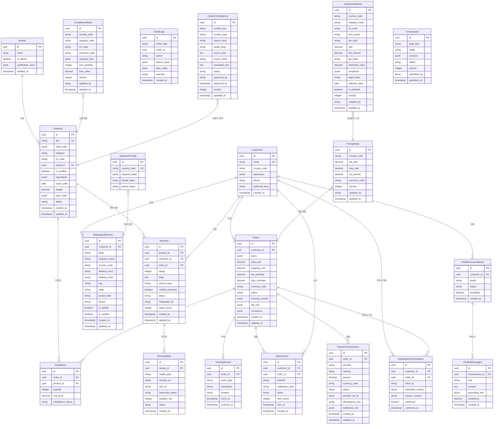

> **ERD 설계 원칙:**
> - `Brands` 엔터티를 독립 분리하여 인증 DB SSOT 역할 명확화 (REQ-FUNC-505, 506)
> - `OrderItems`를 Orders에서 분리하여 SKU별 통관 상태 추적 가능 (REQ-FUNC-203)
> - `ShippingAddresses`를 Customers.addresses JSONB와 별도 정규화하여 검증 이력 관리 (REQ-FUNC-301~305)
> - `TrackingEvents`를 Orders.exceptions JSONB와 별도 정규화하여 이벤트 시계열 조회 최적화 (REQ-FUNC-404, 406)
> - `Notifications` 테이블로 재시도 큐 상태 추적 (REQ-FUNC-405)
> - `AuditLogs`로 룰 테이블 변경 이력 추적 (REQ-NF-019, 023)
> - **(v2.0)** `ContentTranslations`로 원문+로캘별 번역본·검수 상태를 분리 관리 (REQ-FUNC-1501~1507), 핵심 컨텐츠 미승인 시 원문 폴백
> - **(v2.0)** `PaymentTransactions`로 PG(stripe/toss/fiserv)별 거래·정산·멱등키를 기록 (REQ-FUNC-1601~1607)
> - **(v2.0)** `ShippingAddresses`를 사용자 배송지 목록의 SSOT로 확장(label·recipient) + `DestinationConfirmations`로 Geo-IP 추정국과 사용자 선택국의 확인 이력 기록 (REQ-FUNC-1701~1707)
> - **(v2.0)** `ChatbotConversations/Messages`로 챗봇 대화·근거(grounding)·신뢰도·에스컬레이션 로깅 (REQ-FUNC-1801~1807)
> - **(v2.0)** `CustomsTaxItems`로 목적국별 통관규정 세금항목을 PricingRules와 연계 관리(발효일·버전) (REQ-FUNC-1901~1906)
> - **(v2.0)** `CmsLayouts`로 프론트 화면 구성을 로캘·버전별 발행 관리(롤백 가능) (REQ-FUNC-2001~2006)
> - **(v2.0)** `Reviews`/`ReviewMedia`로 사용자 리뷰·리뷰 영상을 검수 상태·CDN 파이프라인과 함께 관리 (REQ-FUNC-2101~2107)

#### 6.2.1 Products

| 필드 | 타입 | 제약 | 설명 |
|---|---|---|---|
| id | UUID | PK | 상품 고유 식별자 |
| sku | VARCHAR(50) | UNIQUE, NOT NULL | 재고관리 단위 코드 |
| name_i18n | JSONB | NOT NULL | 다국어 상품명 (예: {"en": "...", "ko": "..."}) |
| category | VARCHAR(50) | NOT NULL | 상품 카테고리 (beauty, health_supplement 등) |
| hs_code | VARCHAR(20) | NOT NULL | HS Code |
| brand_id | UUID | FK → Brands.id | 브랜드 참조 |
| is_certified | BOOLEAN | NOT NULL, DEFAULT false | 공식 인증 여부 (인증 DB가 SSOT) |
| ingredients | JSONB | NULLABLE | 성분 정보 (건기식용) |
| expiry_date | DATE | NULLABLE | 유통기한 |
| weight | DECIMAL(10,2) | NOT NULL | 무게 (g) |
| price_rules | JSONB | NOT NULL | 가격 정책 |

#### 6.2.2 Orders

| 필드 | 타입 | 제약 | 설명 |
|---|---|---|---|
| id | UUID | PK | 주문 고유 식별자 |
| customer_id | UUID | FK → Customers.id, NOT NULL | 고객 참조 |
| items | JSONB | NOT NULL | 주문 상품 목록 (SKU, qty, unit_price) |
| total_cost | DECIMAL(12,2) | NOT NULL | 합산 총비용 (TLC) |
| shipping_cost | DECIMAL(10,2) | NOT NULL | 배송비 |
| tax_estimate | DECIMAL(10,2) | NOT NULL | 세금·관세 예상액 |
| status | VARCHAR(30) | NOT NULL | 주문 상태 (pending, paid, shipped, customs_hold, delivered 등) |
| eta_info | JSONB | NULLABLE | ETA 정보 (예상 도착일, 갱신일시) |
| exceptions | JSONB | NULLABLE | 예외 이벤트 기록 |

#### 6.2.3 Customers

| 필드 | 타입 | 제약 | 설명 |
|---|---|---|---|
| id | UUID | PK | 고객 고유 식별자 |
| email | VARCHAR(255) | UNIQUE, NOT NULL | 이메일 |
| country_code | VARCHAR(3) | NOT NULL | ISO 3166-1 alpha-2/3 국가코드 |
| addresses | JSONB | NULLABLE | 저장된 배송지 목록 |
| phone | VARCHAR(30) | NULLABLE | 전화번호 |
| preferred_lang | VARCHAR(5) | NOT NULL, DEFAULT 'en' | 선호 언어 (en, ko, ja, zh) |

#### 6.2.4 ComplianceRules

| 필드 | 타입 | 제약 | 설명 |
|---|---|---|---|
| id | UUID | PK | 룰 고유 식별자 |
| country_code | VARCHAR(3) | NOT NULL | 대상 국가 |
| category_code | VARCHAR(50) | NOT NULL | 상품 카테고리 |
| hs_code | VARCHAR(20) | NULLABLE | HS Code (세부 필터) |
| restriction_type | VARCHAR(20) | NOT NULL | allowed / conditional / prohibited |
| required_docs | JSONB | NULLABLE | 필요 서류 목록 |
| max_quantity | INTEGER | NULLABLE | 최대 허용 수량 |
| max_value | DECIMAL(10,2) | NULLABLE | 최대 허용 금액 |
| version | INTEGER | NOT NULL, DEFAULT 1 | 버전 번호 |
| updated_by | VARCHAR(100) | NOT NULL | 최종 수정자 |
| updated_at | TIMESTAMP | NOT NULL | 최종 수정일시 |

#### 6.2.5 PricingRules

| 필드 | 타입 | 제약 | 설명 |
|---|---|---|---|
| id | UUID | PK | 룰 고유 식별자 |
| country_code | VARCHAR(3) | NOT NULL | 대상 국가 |
| tax_rate | DECIMAL(5,4) | NOT NULL | 부가세율 |
| duty_rate | DECIMAL(5,4) | NOT NULL | 관세율 |
| de_minimis | DECIMAL(10,2) | NOT NULL | 면세 기준 금액 |
| currency_code | VARCHAR(3) | NOT NULL | 현지 통화 (ISO 4217) |
| version | INTEGER | NOT NULL, DEFAULT 1 | 버전 번호 |
| updated_by | VARCHAR(100) | NOT NULL | 최종 수정자 |
| updated_at | TIMESTAMP | NOT NULL | 최종 수정일시 |

#### 6.2.6 AddressFormats

| 필드 | 타입 | 제약 | 설명 |
|---|---|---|---|
| id | UUID | PK | 포맷 고유 식별자 |
| country_code | VARCHAR(3) | UNIQUE, NOT NULL | 대상 국가 |
| required_fields | JSONB | NOT NULL | 필수 입력 필드 목록 |
| postal_regex | VARCHAR(255) | NULLABLE | 우편번호 정규식 패턴 |
| phone_regex | VARCHAR(255) | NULLABLE | 전화번호 정규식 패턴 |

#### 6.2.7 ContentTranslations (F15)

| 필드 | 타입 | 제약 | 설명 |
|---|---|---|---|
| id | UUID | PK | 번역 레코드 식별자 |
| content_key | VARCHAR(255) | NOT NULL | 컨텐츠 식별 키 (예: product:{id}:name) |
| content_type | VARCHAR(50) | NOT NULL | front/admin/product/policy/customs 등 |
| source_lang | VARCHAR(5) | NOT NULL, CHECK (in 'ko','en') | 출발어(원문) — 한국어·영어 한정 |
| target_lang | VARCHAR(5) | NOT NULL | 도착어 (en/ko/ja/zh) |
| source_text | TEXT | NOT NULL | 원문 |
| source_hash | VARCHAR(64) | NOT NULL | 원문 해시 (stale 감지용) |
| translated_text | TEXT | NULLABLE | 번역문 |
| status | VARCHAR(20) | NOT NULL | DRAFT / APPROVED / REJECTED / STALE |
| approved_by | VARCHAR(100) | NULLABLE | 검수 승인자 |
| version | INTEGER | NOT NULL, DEFAULT 1 | 버전 |

#### 6.2.8 PaymentTransactions (F16)

| 필드 | 타입 | 제약 | 설명 |
|---|---|---|---|
| id | UUID | PK | 거래 식별자 |
| order_id | UUID | FK → Orders.id, NOT NULL | 주문 참조 |
| provider | VARCHAR(20) | NOT NULL | stripe / toss / fiserv |
| method | VARCHAR(30) | NOT NULL | card / easy_pay / bank_transfer 등 |
| amount | DECIMAL(12,2) | NOT NULL | 결제 금액 |
| currency_code | VARCHAR(3) | NOT NULL | ISO 4217 |
| status | VARCHAR(20) | NOT NULL | pending/authorized/captured/failed/refunded |
| provider_txn_id | VARCHAR(100) | NULLABLE | PG 거래 ID |
| idempotency_key | VARCHAR(100) | UNIQUE, NOT NULL | 멱등키 (중복 방지) |
| settlement_info | JSONB | NULLABLE | 정산 대사 정보 |

#### 6.2.9 ShippingAddresses & DestinationConfirmations (F17)

**ShippingAddresses** (배송지 목록 SSOT) — 주요 추가 필드

| 필드 | 타입 | 제약 | 설명 |
|---|---|---|---|
| label | VARCHAR(50) | NULLABLE | 배송지 별칭 (집·회사 등) |
| recipient_name | VARCHAR(100) | NOT NULL | 수령인 |
| is_default | BOOLEAN | NOT NULL, DEFAULT false | 기본 배송지 (사용자당 1건) |
| is_verified | BOOLEAN | NOT NULL, DEFAULT false | F3 검증 통과 여부 |

**DestinationConfirmations** (Geo-IP 목적국 확인 이력)

| 필드 | 타입 | 제약 | 설명 |
|---|---|---|---|
| id | UUID | PK | 식별자 |
| customer_id | UUID | FK → Customers.id, NOT NULL | 사용자 |
| order_id | UUID | FK → Orders.id, NULLABLE | 주문(확정 시) |
| client_ip | VARCHAR(64) | NOT NULL | 접속 IP (마스킹/해시 저장) |
| estimated_country | VARCHAR(3) | NULLABLE | Geo-IP 추정 국가 |
| chosen_country | VARCHAR(3) | NOT NULL | 사용자 선택 목적국 |
| confirmed | BOOLEAN | NOT NULL | 변경 확인 여부 |
| confirmed_at | TIMESTAMP | NOT NULL | 확인 일시 |

#### 6.2.10 ChatbotConversations / ChatbotMessages (F18)

| 필드 | 타입 | 제약 | 설명 |
|---|---|---|---|
| conversation.id | UUID | PK | 대화 식별자 |
| conversation.customer_id | UUID | FK, NULLABLE | 사용자(비로그인 허용) |
| conversation.locale | VARCHAR(5) | NOT NULL | 응답 로캘 |
| conversation.escalated | BOOLEAN | NOT NULL, DEFAULT false | CS 에스컬레이션 여부 |
| message.conversation_id | UUID | FK | 대화 참조 |
| message.role | VARCHAR(10) | NOT NULL | user / assistant / system |
| message.content | TEXT | NOT NULL | 메시지 (PII 마스킹 후 저장) |
| message.grounding_refs | JSONB | NULLABLE | 근거 출처(룰/주문 ID) |
| message.confidence | DECIMAL(3,2) | NULLABLE | 응답 신뢰도 |

#### 6.2.11 CustomsTaxItems (F19)

| 필드 | 타입 | 제약 | 설명 |
|---|---|---|---|
| id | UUID | PK | 세금항목 식별자 |
| country_code | VARCHAR(3) | NOT NULL | 목적국 |
| category_code | VARCHAR(50) | NULLABLE | 카테고리 (전체 적용 시 NULL) |
| hs_code | VARCHAR(20) | NULLABLE | HS Code (세부 필터) |
| item_name | VARCHAR(100) | NOT NULL | 세금/수수료 항목명 (VAT, 관세, 통관수수료 등) |
| tax_type | VARCHAR(20) | NOT NULL | rate(%) / flat(정액) |
| rate | DECIMAL(6,4) | NULLABLE | 세율 (tax_type=rate) |
| flat_amount | DECIMAL(10,2) | NULLABLE | 정액 (tax_type=flat) |
| tax_base | VARCHAR(30) | NOT NULL | 과세표준 (상품가/CIF/총액 등) |
| threshold_value | DECIMAL(10,2) | NULLABLE | 면세·적용 기준 금액 |
| conditions | JSONB | NULLABLE | 적용 조건 |
| legal_basis | VARCHAR(255) | NULLABLE | 근거 규정 |
| effective_date | DATE | NOT NULL | 발효일 |
| is_estimate | BOOLEAN | NOT NULL, DEFAULT false | 추정/disclaimer 필요 여부 |
| version | INTEGER | NOT NULL, DEFAULT 1 | 버전 |
| updated_by | VARCHAR(100) | NOT NULL | 최종 수정자 |

#### 6.2.12 CmsLayouts (F20)

| 필드 | 타입 | 제약 | 설명 |
|---|---|---|---|
| id | UUID | PK | 레이아웃 식별자 |
| page_key | VARCHAR(100) | NOT NULL | 페이지 키 (home, category:{id} 등) |
| locale | VARCHAR(5) | NULLABLE | 로캘 (NULL=공통, F15 연계) |
| sections | JSONB | NOT NULL | 섹션·배너·노출 SKU·영상 배치 구성 |
| status | VARCHAR(20) | NOT NULL | DRAFT / PUBLISHED / ARCHIVED |
| version | INTEGER | NOT NULL, DEFAULT 1 | 버전 (롤백용) |
| published_by | VARCHAR(100) | NULLABLE | 발행자 |
| published_at | TIMESTAMP | NULLABLE | 발행일시 |

#### 6.2.13 Reviews / ReviewMedia (F21)

| 필드 | 타입 | 제약 | 설명 |
|---|---|---|---|
| review.id | UUID | PK | 리뷰 식별자 |
| review.product_id | UUID | FK → Products.id | 대상 상품 |
| review.customer_id | UUID | FK → Customers.id | 작성자 |
| review.order_id | UUID | FK → Orders.id, NULLABLE | 구매 검증용 주문 |
| review.rating | SMALLINT | NOT NULL, CHECK 1~5 | 평점 |
| review.body | TEXT | NULLABLE | 리뷰 본문 |
| review.source_lang | VARCHAR(5) | NULLABLE | 원문 언어 (UGC 번역용) |
| review.verified_purchase | BOOLEAN | NOT NULL, DEFAULT false | 구매 검증 여부 |
| review.status | VARCHAR(20) | NOT NULL | PENDING / APPROVED / REJECTED / HIDDEN |
| review.report_count | INTEGER | NOT NULL, DEFAULT 0 | 신고 누적 수 |
| media.review_id | UUID | FK → Reviews.id | 리뷰 참조 |
| media.media_type | VARCHAR(10) | NOT NULL | image / video |
| media.cdn_url | VARCHAR(500) | NULLABLE | CDN 스트리밍 URL |
| media.transcode_status | VARCHAR(20) | NULLABLE | 트랜스코딩 상태 (video) |
| media.status | VARCHAR(20) | NOT NULL | PENDING / APPROVED / REJECTED |

### 6.3 Detailed Interaction Models

#### 6.3.1 전체 MVP 사용자 여정 시퀀스

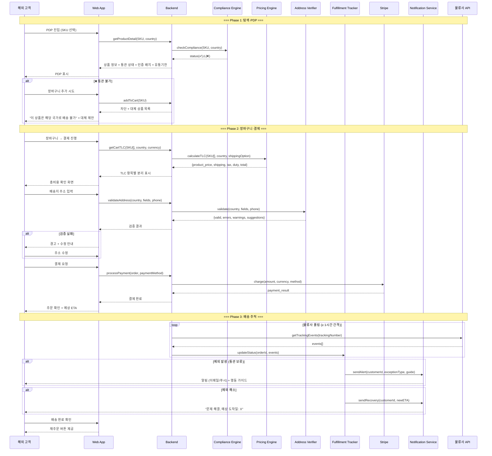

#### 6.3.2 Admin 룰 테이블 관리 시퀀스

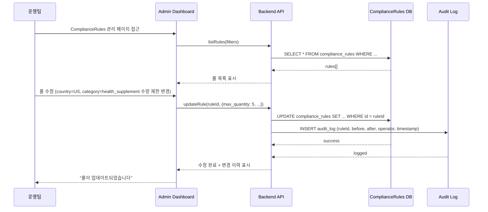

#### 6.3.3 알림 재시도 및 에스컬레이션 시퀀스

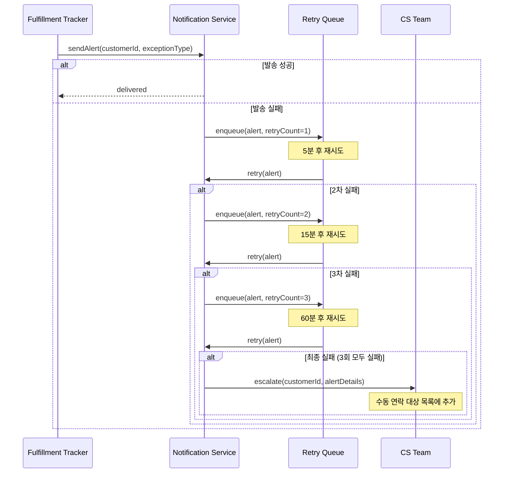

#### 6.3.4 환율 API 폴백 시퀀스

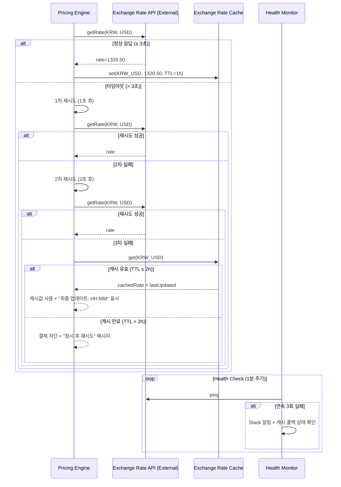

### 6.4 Validation Plan

| 실험 ID | 가설 | 설계 | 최소 표본(n) | 성공 기준 | 통계 검정 | 측정 도구 |
|---|---|---|---|---|---|---|
| EXP-1 | TLC 표시 시 전환율 상승 | A/B (2주+). Control: 상품가+배송비만 / Treatment: TLC 전체 | ≥ 500/군 | 전환율 +5%p (10→15%), p < 0.05, 검정력 ≥ 0.8 | 카이제곱 | Mixpanel Funnel |
| EXP-2 | 통관 상태 표시 시 실패율 감소 | Before/After (4주 vs 4주) | ≥ 300 주문/군 | 실패율 8→3%, p < 0.05 | Fisher 정확 검정 | 물류사 반려 API |
| EXP-3 | 실시간 주소 검증 시 배송 실패 감소 | Before/After (4주 vs 4주) | ≥ 300 주문/군 | 주소 오류 실패 15→5%, p < 0.05 | 이항 비율 검정 | 배송 실패 사유 로그 |
| EXP-4 | 인증 배지·보증 시 첫 구매 전환 상승 | A/B (2주+). 배지+보증 유/무 | ≥ 500/군 | 첫 구매 전환 +3%p, p < 0.05 | 카이제곱 | Funnel + 5점 신뢰도 설문 |
| EXP-5 | 예외 가이드 시 CS 감소 | Before/After (4주 vs 4주) | ≥ 200 예외건/군 | CS 비중 50→30%, p < 0.05 | 이항 비율 검정 | CS 티켓 태그 분류 |

### 6.5 Rollout Plan

| 단계 | 기간 | 범위 | 목적 |
|---|---|---|---|
| Alpha | W10~12 | 내부 + 10명 테스터 | 기능 안정성·UX 검증 |
| Closed Beta | W13~16 | 50명 교민 커뮤니티 | 거래 완료율·CS 패턴 |
| Open Beta | W17~20 | 500명 (3개국) | 전환율·통관·NPS |
| GA | W21~ | 5개국 전면 오픈 | 북극성 KPI 추적 |

### 6.6 Use Case Diagram

```mermaid
graph TB
    subgraph "Actors — 고객 (Day 1 Core)"
        Sarah["👤 Sarah Kim<br/>정품 신뢰형 반복구매"]
        Ahmed["👤 Ahmed Rahman<br/>주소·통관 실패 반복"]
        Maria["👤 Maria Gonzalez<br/>가족 건강관리"]
    end

    subgraph "Actors — 고객 (Day 2 확장)"
        Carlos["👤 Carlos Mendez<br/>해외직구 불신·회피형"]
        Linda["👤 Linda Park<br/>공동구매 운영형"]
    end

    subgraph "Actors — 내부 운영"
        OpsAdmin["🔧 운영팀 관리자"]
    end

    subgraph "Actors — 외부 시스템"
        StripeAPI["💳 Stripe PG"]
        LogisticsAPI["🚚 물류사 Tracking API"]
        ExchangeAPI["💱 환율 API"]
        AddressAPI["📍 Google/Loqate API"]
    end

    subgraph "Use Cases — F1 총비용 확정"
        UC101["UC-101<br/>결제 전 TLC 확인"]
        UC102["UC-102<br/>현지 통화 변환 조회"]
        UC103["UC-103<br/>세금 불확실 시 disclaimer 확인"]
    end

    subgraph "Use Cases — F2 통관 확인"
        UC201["UC-201<br/>통관 가능 여부 조회"]
        UC202["UC-202<br/>조건부 통관 상세 확인"]
        UC203["UC-203<br/>통관 불가 시 대체 상품 확인"]
    end

    subgraph "Use Cases — F3 주소 검증"
        UC301["UC-301<br/>주소 실시간 검증"]
        UC302["UC-302<br/>전화번호 형식 검증"]
    end

    subgraph "Use Cases — F4 배송 추적"
        UC401["UC-401<br/>배송 상태·ETA 조회"]
        UC402["UC-402<br/>예외 발생 시 행동 가이드 수신"]
        UC403["UC-403<br/>예외 해소 알림 수신"]
    end

    subgraph "Use Cases — F5 정품 신뢰"
        UC501["UC-501<br/>정품 인증 배지 확인"]
        UC502["UC-502<br/>유통기한 확인"]
        UC503["UC-503<br/>정품 보증 정책 조회"]
    end

    subgraph "Use Cases — F6 건기식"
        UC601["UC-601<br/>건기식 성분·복용법 확인"]
    end

    subgraph "Use Cases — F7 재주문"
        UC701["UC-701<br/>과거 주문 빠른 재주문"]
    end

    subgraph "Use Cases — Admin"
        UCA01["UCA-01<br/>ComplianceRules CRUD"]
        UCA02["UCA-02<br/>PricingRules CRUD"]
        UCA03["UCA-03<br/>브랜드 인증 데이터 관리"]
        UCA04["UCA-04<br/>건기식 설명 데이터 입력"]
        UCA05["UCA-05<br/>변경 이력·감사 로그 조회"]
    end

    %% 고객 → Use Case 연결
    Sarah --> UC101
    Sarah --> UC501
    Sarah --> UC502
    Sarah --> UC701
    Ahmed --> UC201
    Ahmed --> UC301
    Ahmed --> UC302
    Ahmed --> UC401
    Maria --> UC201
    Maria --> UC402
    Maria --> UC601
    Carlos --> UC101
    Carlos --> UC501
    Carlos --> UC503
    Linda --> UC701

    %% 모든 고객 공통
    Sarah --> UC401
    Maria --> UC101
    Ahmed --> UC101

    %% 운영팀 → Admin Use Case
    OpsAdmin --> UCA01
    OpsAdmin --> UCA02
    OpsAdmin --> UCA03
    OpsAdmin --> UCA04
    OpsAdmin --> UCA05

    %% 외부 시스템 → Use Case 연결
    ExchangeAPI -.-> UC102
    StripeAPI -.-> UC101
    AddressAPI -.-> UC301
    LogisticsAPI -.-> UC401
    LogisticsAPI -.-> UC402
    LogisticsAPI -.-> UC403
```

> **Use Case → REQ 매핑:**
>
> | Use Case | 관련 REQ-FUNC | 비고 |
> |---|---|---|
> | UC-101~103 | REQ-FUNC-101~107 | F1 TLC 표시 |
> | UC-201~203 | REQ-FUNC-201~207 | F2 통관 판정 |
> | UC-301~302 | REQ-FUNC-301~306 | F3 주소·전화번호 검증 |
> | UC-401~403 | REQ-FUNC-401~407 | F4 배송 추적·예외 가이드 |
> | UC-501~503 | REQ-FUNC-501~506 | F5 정품 신뢰 신호 |
> | UC-601 | REQ-FUNC-601~603 | F6 건기식 설명 카드 |
> | UC-701 | REQ-FUNC-701~702 | F7 빠른 재주문 |
> | UCA-01~05 | REQ-FUNC-207, REQ-NF-019, 022, 023 | Admin 룰 관리·감사 |

#### 6.6.1 v2.0 신규 Use Case Diagram

```mermaid
graph TB
    subgraph "Actors — 고객"
        Cust["👤 로그인 고객"]
        Guest["👥 비로그인 방문자"]
    end

    subgraph "Actors — 내부 운영"
        ContentOp["🎨 콘텐츠/머천다이징 운영자"]
        OpsAdmin["🔧 운영팀 관리자"]
        CSOp["💬 CS 운영자"]
    end

    subgraph "Actors — 외부 시스템"
        LLM["🤖 LLM API"]
        Toss["💳 Toss Payments"]
        Fiserv["💳 Fiserv"]
        Stripe2["💳 Stripe"]
        GeoIP["🌐 Geo-IP"]
        VideoCDN["🎬 Video CDN"]
    end

    subgraph "Use Cases — F15 AI 번역"
        UC1501["UC-1501 다국어 컨텐츠 열람"]
        UC1502["UC-1502 AI 번역 검수·승인"]
    end
    subgraph "Use Cases — F16 결제"
        UC1601["UC-1601 PG 선택·결제(Toss/Fiserv/Stripe)"]
        UC1602["UC-1602 거래·정산 대사"]
    end
    subgraph "Use Cases — F17 배송지·목적국"
        UC1701["UC-1701 배송지 목록 관리"]
        UC1702["UC-1702 목적국 확인 프로세스"]
    end
    subgraph "Use Cases — F18 챗봇"
        UC1801["UC-1801 자연어 CS 질의"]
        UC1802["UC-1802 챗봇 대화 모니터링"]
    end
    subgraph "Use Cases — F19 통관규정 세금"
        UC1901["UC-1901 세금항목 확인(프론트)"]
        UC1902["UC-1902 세금항목 CRUD(어드민)"]
    end
    subgraph "Use Cases — F20 CMS·리뷰영상"
        UC2001["UC-2001 화면 구성·발행"]
        UC2002["UC-2002 리뷰 영상 큐레이션"]
    end
    subgraph "Use Cases — F21 리뷰"
        UC2101["UC-2101 리뷰 작성·열람"]
        UC2102["UC-2102 리뷰 검수·신고처리"]
    end

    Cust --> UC1501
    Guest --> UC1501
    Cust --> UC1601
    Cust --> UC1701
    Cust --> UC1702
    Cust --> UC1801
    Guest --> UC1801
    Cust --> UC1901
    Guest --> UC1901
    Cust --> UC2101
    Guest --> UC2101

    ContentOp --> UC1502
    ContentOp --> UC2001
    ContentOp --> UC2002
    ContentOp --> UC2102
    OpsAdmin --> UC1902
    OpsAdmin --> UC1602
    CSOp --> UC1802
    CSOp --> UC2102

    LLM -.-> UC1501
    LLM -.-> UC1801
    Toss -.-> UC1601
    Fiserv -.-> UC1601
    Stripe2 -.-> UC1601
    GeoIP -.-> UC1702
    VideoCDN -.-> UC2002
```

> **v2.0 Use Case → REQ 매핑:**
>
> | Use Case | 관련 REQ-FUNC |
> |---|---|
> | UC-1501~1502 | REQ-FUNC-1501~1507 |
> | UC-1601~1602 | REQ-FUNC-1601~1607 |
> | UC-1701~1702 | REQ-FUNC-1701~1707 |
> | UC-1801~1802 | REQ-FUNC-1801~1807 |
> | UC-1901~1902 | REQ-FUNC-1901~1906 |
> | UC-2001~2002 | REQ-FUNC-2001~2006 |
> | UC-2101~2102 | REQ-FUNC-2101~2107 |

### 6.7 Component Diagram

```mermaid
graph TB
    subgraph "Client Layer"
        WEB["🌐 Web Application<br/>(SPA — React)"]
        ADMIN["🔧 Admin Dashboard<br/>(React)"]
    end

    subgraph "API Gateway Layer"
        GW["API Gateway<br/>인증 · 라우팅 · Rate Limit"]
    end

    subgraph "Core Platform (Modular Monolith)"
        direction TB

        subgraph "Product Domain"
            PRODUCT_SVC["Product Service<br/>- 상품 조회<br/>- 카탈로그 관리<br/>- 인증 배지 판정 (SSOT)"]
            SUPPLEMENT_SVC["Supplement Info Service<br/>- 건기식 성분·복용법<br/>- 다국어 설명 카드"]
        end

        subgraph "Order Domain"
            ORDER_SVC["Order Service<br/>- 주문 생성·상태 관리<br/>- 장바구니 관리<br/>- 빠른 재주문"]
            CART_SVC["Cart Service<br/>- 장바구니 CRUD<br/>- 통관 차단 연동"]
        end

        subgraph "Pricing Domain"
            PRICING_ENGINE["⚙️ Pricing Engine<br/>- TLC 산출<br/>- 세율·관세율 조회<br/>- 환율 변환<br/>- 캐시 폴백"]
        end

        subgraph "Compliance Domain"
            COMPLIANCE_ENGINE["⚙️ Compliance Engine<br/>- 통관 판정 (✅⚠️❌)<br/>- 룰 테이블 조회<br/>- 대체 상품 제안<br/>- 캐시 폴백"]
        end

        subgraph "Fulfillment Domain"
            FULFILLMENT_TRACKER["⚙️ Fulfillment Tracker<br/>- 배송 상태 매핑<br/>- ETA 계산·재계산<br/>- 예외 감지·가이드<br/>- 물류사 폴링"]
        end

        subgraph "Address Domain"
            ADDRESS_VERIFIER["⚙️ Address Verifier<br/>- Regex 1차 검증<br/>- 외부 API 2차 검증<br/>- 폴백 전환<br/>- libphonenumber"]
        end

        subgraph "Notification Domain"
            NOTIFICATION_SVC["📨 Notification Service<br/>- 이메일·푸시 발송<br/>- 재시도 큐 (3회)<br/>- 에스컬레이션"]
        end

        subgraph "Admin Domain"
            ADMIN_SVC["🔐 Admin Service<br/>- ComplianceRules CRUD<br/>- PricingRules CRUD<br/>- 브랜드 인증 관리<br/>- 감사 로그"]
        end
    end

    subgraph "Data Layer"
        DB_PRIMARY[("🗄️ PostgreSQL Primary<br/>Products · Orders · Customers<br/>ComplianceRules · PricingRules<br/>AddressFormats · AuditLogs")]
        CACHE[("⚡ Redis Cache<br/>환율 캐시 (TTL 1h)<br/>통관 판정 캐시<br/>세션")]
    end

    subgraph "External Services"
        EXT_EXCHANGE["💱 Open Exchange Rates"]
        EXT_ADDRESS["📍 Google / Loqate"]
        EXT_LOGISTICS["🚚 물류사 Tracking API"]
        EXT_STRIPE["💳 Stripe PG"]
        EXT_EMAIL["📧 이메일 서비스"]
        EXT_PUSH["📱 푸시 서비스"]
    end

    subgraph "Observability"
        MON["📊 CloudWatch / Datadog<br/>APM · Metrics · Logs"]
        ALERT["🚨 PagerDuty / Slack<br/>알림 라우팅"]
    end

    %% Client → Gateway
    WEB --> GW
    ADMIN --> GW

    %% Gateway → Services
    GW --> PRODUCT_SVC
    GW --> ORDER_SVC
    GW --> CART_SVC
    GW --> PRICING_ENGINE
    GW --> COMPLIANCE_ENGINE
    GW --> ADDRESS_VERIFIER
    GW --> FULFILLMENT_TRACKER
    GW --> SUPPLEMENT_SVC
    GW --> ADMIN_SVC

    %% Inter-service 의존성
    ORDER_SVC --> PRICING_ENGINE
    ORDER_SVC --> COMPLIANCE_ENGINE
    CART_SVC --> COMPLIANCE_ENGINE
    ORDER_SVC --> ADDRESS_VERIFIER
    FULFILLMENT_TRACKER --> NOTIFICATION_SVC
    PRODUCT_SVC --> COMPLIANCE_ENGINE
    ADMIN_SVC --> DB_PRIMARY

    %% Data Layer
    PRODUCT_SVC --> DB_PRIMARY
    ORDER_SVC --> DB_PRIMARY
    COMPLIANCE_ENGINE --> DB_PRIMARY
    PRICING_ENGINE --> DB_PRIMARY
    ADDRESS_VERIFIER --> DB_PRIMARY
    FULFILLMENT_TRACKER --> DB_PRIMARY
    NOTIFICATION_SVC --> DB_PRIMARY

    PRICING_ENGINE --> CACHE
    COMPLIANCE_ENGINE --> CACHE

    %% External
    PRICING_ENGINE --> EXT_EXCHANGE
    ADDRESS_VERIFIER --> EXT_ADDRESS
    FULFILLMENT_TRACKER --> EXT_LOGISTICS
    ORDER_SVC --> EXT_STRIPE
    NOTIFICATION_SVC --> EXT_EMAIL
    NOTIFICATION_SVC --> EXT_PUSH

    %% Observability
    GW -.-> MON
    PRICING_ENGINE -.-> MON
    COMPLIANCE_ENGINE -.-> MON
    FULFILLMENT_TRACKER -.-> MON
    MON -.-> ALERT
```

> **아키텍처 설계 원칙 (ADR-4 기반):**
> - 초기에는 **모듈러 모놀리스**로 배포하되 도메인 경계를 명확히 분리
> - Pricing Engine · Compliance Engine · Fulfillment Tracker는 독립 모듈로 `country_code` 파라미터 기반 권역별 동작
> - 트래픽 증가(동시 접속 500→2,000) 시 핵심 엔진 3개를 우선 마이크로서비스로 점진적 분리
> - Redis 캐시 레이어로 환율(TTL 1h)·통관 판정 캐시 관리, 외부 API 장애 내성 확보
> - API Gateway에서 인증·Rate Limit·라우팅 일괄 처리

#### 6.7.1 v2.0 신규 컴포넌트 (확장)

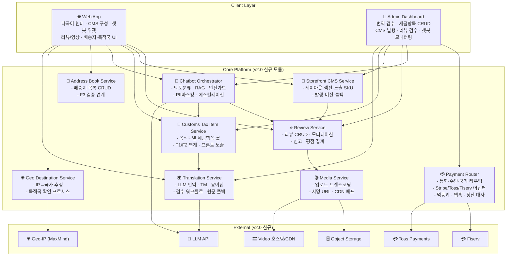

> **v2.0 아키텍처 통합 원칙:**
> - 신규 모듈도 ADR-4의 모듈러 모놀리스 경계를 따르며 `country_code`·`locale` 파라미터 기반 동작
> - **Payment Router**는 어댑터 패턴으로 PG(Stripe/Toss/Fiserv)를 추상화, 장애 시 폴백·정산 대사 일원화
> - **Translation Service**는 TM 캐시(Redis) 우선, LLM 호출 최소화로 비용 통제 (RSK-12)
> - **Chatbot Orchestrator**는 RAG로 룰·주문 데이터에 근거하며 안전 가드·에스컬레이션을 강제 (CON-10)
> - **Customs Tax Item Service**는 Pricing/Compliance Engine과 연계되어 F1/F2 산출에 세금항목을 주입

### 6.8 Class Diagram

```mermaid
classDiagram
    direction TB

    class Product {
        -UUID id
        -String sku
        -Map~String,String~ nameI18n
        -String category
        -String hsCode
        -UUID brandId
        -Boolean isCertified
        -Map~String,Object~ ingredients
        -LocalDate expiryDate
        -BigDecimal weight
        -Map~String,Object~ priceRules
        -ProductStatus status
        +getRemainingDays() int
        +isExpiringSoon(int thresholdDays) boolean
        +getLocalizedName(String lang) String
    }

    class Brand {
        -UUID id
        -String name
        -Boolean isOfficial
        -Map~String,Object~ certificationDocs
        -LocalDateTime certifiedAt
        +isCertified() boolean
    }

    class Customer {
        -UUID id
        -String email
        -String countryCode
        -String phone
        -String preferredLang
        -LocalDateTime createdAt
        +getPreferredCurrency() String
    }

    class ShippingAddress {
        -UUID id
        -UUID customerId
        -String countryCode
        -String addressLine1
        -String addressLine2
        -String city
        -String state
        -String postalCode
        -String phone
        -Boolean isDefault
        -Boolean isVerified
        +toValidationRequest() AddressValidationRequest
    }

    class Order {
        -UUID id
        -UUID customerId
        -List~OrderItem~ items
        -BigDecimal totalCost
        -BigDecimal shippingCost
        -BigDecimal taxEstimate
        -BigDecimal dutyEstimate
        -String currencyCode
        -OrderStatus status
        -String trackingNumber
        -EtaInfo etaInfo
        -List~OrderException~ exceptions
        -LocalDateTime createdAt
        +getTLC() TotalLandedCost
        +hasActiveException() boolean
        +canReorder() boolean
    }

    class OrderItem {
        -UUID id
        -UUID orderId
        -UUID productId
        -Integer quantity
        -BigDecimal unitPrice
        -ComplianceStatus complianceStatus
        +getSubtotal() BigDecimal
    }

    class TotalLandedCost {
        -BigDecimal productPrice
        -BigDecimal shippingCost
        -BigDecimal taxAmount
        -BigDecimal dutyAmount
        -BigDecimal totalAmount
        -String currencyCode
        -Boolean isEstimate
        -LocalDateTime lastUpdated
        +hasDisclaimer() boolean
        +convertTo(String targetCurrency, BigDecimal rate) TotalLandedCost
    }

    class ComplianceRule {
        -UUID id
        -String countryCode
        -String categoryCode
        -String hsCode
        -RestrictionType restrictionType
        -List~String~ requiredDocs
        -Integer maxQuantity
        -BigDecimal maxValue
        -Integer version
        -String updatedBy
        -LocalDateTime updatedAt
        +isAllowed() boolean
        +isConditional() boolean
        +isProhibited() boolean
    }

    class ComplianceResult {
        -ComplianceStatus status
        -List~String~ conditions
        -List~String~ requiredDocuments
        -List~Product~ alternativeProducts
        +getStatusBadge() String
    }

    class PricingRule {
        -UUID id
        -String countryCode
        -BigDecimal taxRate
        -BigDecimal dutyRate
        -BigDecimal deMinimis
        -String currencyCode
        -Integer version
        -String updatedBy
        -LocalDateTime updatedAt
        +isDeMinimisApplicable(BigDecimal value) boolean
        +calculateTax(BigDecimal baseValue) BigDecimal
        +calculateDuty(BigDecimal baseValue) BigDecimal
    }

    class AddressFormat {
        -UUID id
        -String countryCode
        -List~String~ requiredFields
        -String postalRegex
        -String phoneRegex
        +validate(ShippingAddress address) AddressValidationResult
    }

    class AddressValidationResult {
        -Boolean isValid
        -List~ValidationError~ errors
        -List~ValidationWarning~ warnings
        -List~String~ suggestions
        -ValidationMode mode
        +isHighRisk() boolean
    }

    class TrackingEvent {
        -UUID id
        -UUID orderId
        -TrackingEventType eventType
        -String description
        -String location
        -LocalDateTime eventAt
        -LocalDateTime receivedAt
        +toStandardStatus() StandardShippingStatus
    }

    class EtaInfo {
        -LocalDate estimatedArrival
        -LocalDate originalEstimate
        -Integer delayDays
        -String delayReason
        -LocalDateTime lastUpdated
        +isDelayed() boolean
        +getAccuracy() BigDecimal
    }

    class Notification {
        -UUID id
        -UUID customerId
        -UUID orderId
        -NotificationChannel channel
        -NotificationType type
        -NotificationStatus status
        -Integer retryCount
        -LocalDateTime sentAt
        +shouldRetry() boolean
        +getNextRetryDelay() Duration
        +shouldEscalate() boolean
    }

    class AuditLog {
        -UUID id
        -String entityType
        -UUID entityId
        -AuditAction action
        -Map~String,Object~ beforeValue
        -Map~String,Object~ afterValue
        -String operator
        -LocalDateTime createdAt
    }

    %% Enumerations
    class OrderStatus {
        <<enumeration>>
        PENDING
        PAID
        SHIPPED
        CUSTOMS_HOLD
        CUSTOMS_CLEARED
        IN_DELIVERY
        DELIVERED
        RETURNED
        CANCELLED
    }

    class ComplianceStatus {
        <<enumeration>>
        ALLOWED
        CONDITIONAL
        PROHIBITED
        PENDING_REVIEW
    }

    class RestrictionType {
        <<enumeration>>
        ALLOWED
        CONDITIONAL
        PROHIBITED
    }

    class TrackingEventType {
        <<enumeration>>
        SHIPPED
        IN_TRANSIT_INTERNATIONAL
        CUSTOMS_PROCESSING
        CUSTOMS_CLEARED
        CUSTOMS_HOLD
        LOCAL_DELIVERY
        DELIVERED
        RETURNED
        EXCEPTION
    }

    class StandardShippingStatus {
        <<enumeration>>
        SHIPMENT_CREATED
        INTERNATIONAL_TRANSIT
        CUSTOMS_IN_PROGRESS
        CUSTOMS_COMPLETE
        LOCAL_DELIVERY
        DELIVERED
    }

    class NotificationChannel {
        <<enumeration>>
        EMAIL
        PUSH
    }

    class NotificationStatus {
        <<enumeration>>
        PENDING
        SENT
        FAILED
        ESCALATED
    }

    class ValidationMode {
        <<enumeration>>
        FULL_EXTERNAL
        REGEX_FALLBACK
        BASIC_ONLY
    }

    class ProductStatus {
        <<enumeration>>
        ACTIVE
        OUT_OF_STOCK
        DISCONTINUED
    }

    %% ===== Relationships =====
    Brand "1" --> "*" Product : owns
    Product "1" --> "*" OrderItem : ordered as
    Customer "1" --> "*" Order : places
    Customer "1" --> "*" ShippingAddress : registers
    Order "1" --> "*" OrderItem : contains
    Order "1" --> "1" TotalLandedCost : has
    Order "1" --> "*" TrackingEvent : tracked by
    Order "1" --> "0..1" EtaInfo : has
    Order "1" --> "*" Notification : triggers
    Customer "1" --> "*" Notification : receives
    ComplianceRule "1" --> "*" ComplianceResult : produces
    PricingRule "1" --> "*" TotalLandedCost : calculates
    AddressFormat "1" --> "*" AddressValidationResult : produces
    TrackingEvent "*" --> "1" TrackingEventType : typed as
    Order "*" --> "1" OrderStatus : has status
    OrderItem "*" --> "1" ComplianceStatus : has status
    ComplianceRule "*" --> "1" RestrictionType : typed as
    Notification "*" --> "1" NotificationChannel : via
    Notification "*" --> "1" NotificationStatus : has status
    AddressValidationResult "*" --> "1" ValidationMode : validated by
```

> **Class Diagram 설계 원칙:**
>
> | 설계 결정 | 근거 |
> |---|---|
> | `TotalLandedCost` Value Object 분리 | F1의 TLC 항목별 분리 표시 + 환율 변환 + disclaimer 로직을 캡슐화. `convertTo()` 메서드로 REQ-FUNC-102 현지 통화 변환을 모델 수준에서 지원 |
> | `ComplianceResult` Value Object 분리 | Compliance Engine의 판정 결과(상태+조건+대체상품)를 단일 객체로 반환. REQ-FUNC-201~203의 ✅/⚠️/❌ 판정 흐름을 표현 |
> | `AddressValidationResult`에 `ValidationMode` 포함 | REQ-FUNC-304~305의 폴백 전환(FULL_EXTERNAL → REGEX_FALLBACK → BASIC_ONLY)을 명시적 상태로 관리 |
> | `Notification`에 `shouldRetry()`, `shouldEscalate()` 포함 | REQ-FUNC-405의 재시도 큐(3회, 5분·15분·60분) + 에스컬레이션 로직을 도메인 모델에 내장 |
> | `EtaInfo` Value Object 분리 | REQ-FUNC-402의 ETA 재계산·지연 정보를 독립 관리. `isDelayed()`로 예외 상태 즉시 판별 |
> | Enum 기반 상태 관리 | `OrderStatus`, `ComplianceStatus`, `TrackingEventType` 등으로 상태 전이를 타입 안전하게 관리. REQ-FUNC-406의 표준 상태 매핑 지원 |
> | `AuditLog` 독립 엔터티 | ADR-1 룰 테이블 변경 이력 + REQ-NF-019 감사 로그. `beforeValue`/`afterValue` JSONB로 범용 변경 추적 |

#### 6.8.1 v2.0 신규 Class Diagram

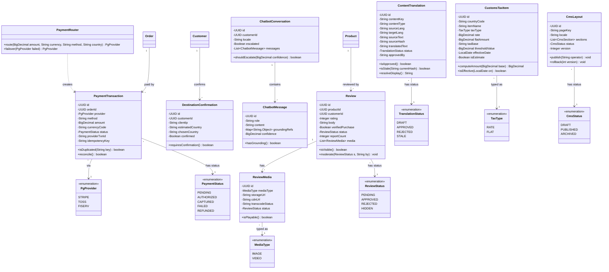

> **v2.0 Class Diagram 설계 원칙:**
>
> | 설계 결정 | 근거 |
> |---|---|
> | `ContentTranslation`에 `isStale()`·`resolveDisplay()` | 원문 변경 감지(sourceHash) + 미승인/stale 시 원문 폴백을 모델에 내장 (REQ-FUNC-1504, 1507) |
> | `PaymentRouter` + `PgProvider` enum + `PaymentTransaction.isDuplicated()` | 통화·수단·국가 기반 라우팅과 멱등 중복 방지·정산 대사를 캡슐화 (REQ-FUNC-1601~1606) |
> | `DestinationConfirmation.requiresConfirmation()` | Geo-IP 추정국≠선택국 시 확인 프로세스를 명시적 도메인 규칙으로 표현 (REQ-FUNC-1704~1706) |
> | `ChatbotConversation.shouldEscalate()` + `ChatbotMessage.hasGrounding()` | RAG 근거·신뢰도 기반 에스컬레이션을 도메인 모델에 내장 (REQ-FUNC-1802~1804) |
> | `CustomsTaxItem.computeAmount()`·`isEffective()` | 발효일 기준 적용과 과세표준 계산을 캡슐화, F1/F2와 연계 (REQ-FUNC-1902, 1906) |
> | `CmsLayout.publish()`·`rollback()` | 버전 기반 발행·롤백을 모델 수준에서 지원 (REQ-FUNC-2005, 2006) |
> | `Review.moderate()`·`isVisible()` + `ReviewMedia.isPlayable()` | 검수 상태 게이트와 영상 재생 가능 여부를 도메인 규칙으로 강제 (REQ-FUNC-2102, 2107) |

---

*End of SRS-001 v2.0*
